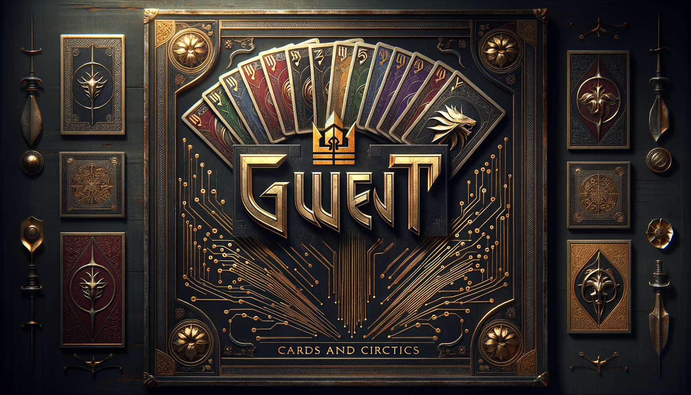
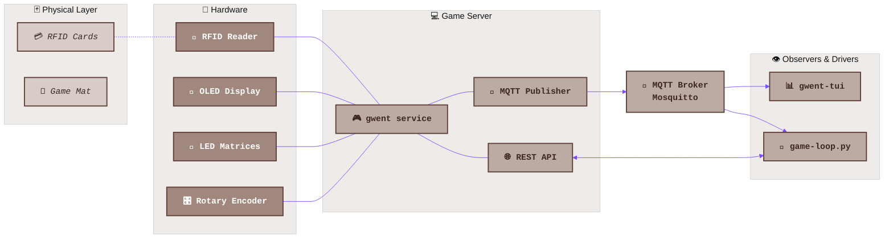

# Gwent Companion

<div align="center">
  
</div>

A Raspberry Pi-based digital companion for the physical card game Gwent from The Witcher III. Players use RFID-tagged physical cards; the companion tracks scores, manages game state, and guides players through the game.



## How It Works

1. The `gwent` system service runs on a Raspberry Pi, managing game state and driving all hardware
2. Players scan RFID-tagged cards on the reader to register decks, deal hands, and play cards
3. The server publishes every game state change over MQTT topics
4. An HTTP REST API exposes game state for polling and control
5. The **gwent-tui** terminal dashboard subscribes to MQTT and renders a live view of the game
6. The **game-loop.py** orchestrator pits two LLM models against each other by driving moves through the REST API

## Components

### Game Server (`software/gwent/`)

The core Python service. Runs as a systemd unit (`gwent`).

- **Game stages state machine** -- MainMenu, RegisterLeaders, RegisterDecks, DealCards, PlayRound, RoundEnd, GameOver
- **MQTT command & control** -- all events and full game state are published to `gwent/` topics via a Mosquitto broker. State is a retained snapshot on `gwent/server/state`; commands (players, client-tts, save) come in on `gwent/ctrl/*`. No HTTP.
- **Hardware abstraction layer** -- SPI (RFID RC522, SSD1306 OLED), I2C (TCA9548A mux, IS31FL3731 LED matrices), GPIO (rotary encoder)
- **Audio system** -- sound effects and TTS announcements (multiple providers: gTTS, ElevenLabs, OpenAI, Piper, macOS `say`)

### Terminal Dashboard (`software/gwent-tui/`)

A [Textual](https://textual.textualize.io/)-based Rich terminal app that renders a live game dashboard. Subscribes to MQTT topics and polls the REST API for full state snapshots. Stage-specific widgets mirror the server's state machine.

### LLM-vs-LLM Orchestrator (`.claude/skills/llm-vs/scripts/game-loop.py`)

Drives fully automated games between two LLM models. Supports multiple providers (Anthropic, OpenAI, Google Gemini, Ollama) with model aliases. Reads game state from the REST API, constructs prompts with full board context, and submits moves via MQTT.

### Shared Utilities (`software/gwent-shared/`)

TTS provider abstractions shared between server and TUI. No hardware dependencies.

## Hardware

| Bus | Device | Purpose |
|-----|--------|---------|
| SPI CE0 | MFRC522 | RFID card reader |
| SPI CE1 | SSD1306 | 128x64 OLED display |
| I2C (via TCA9548A mux) | IS31FL3731 Ch 0 | Gem display (lives) |
| I2C (via TCA9548A mux) | IS31FL3731 Ch 1 | Player 1 score |
| I2C (via TCA9548A mux) | IS31FL3731 Ch 2 | Player 2 score |
| GPIO | Rotary encoder + button | Menu navigation and selection |

## Card Data

Each card is a JSON file in `software/data/cards/{Faction}/CardName.json`:

```json
{
  "faction": "Monsters",
  "name": "Arachas: 1",
  "strength": 4,
  "ranges": ["close"],
  "abilities": ["muster"],
  "starter": true,
  "rfid": 622264733154
}
```

Five factions: **Monsters**, **Nilfgaardian**, **Northern Realms**, **Scoiatael**, **Skellige**, plus **Neutral** cards.

## Development

```bash
# Start the dev server
bash scripts/dev-server.sh gwent start

# Dump current game state
kill -USR1 $(pgrep -f gwent-venv/bin/gwent)

# Run the TUI
gwent-tui

# Run an LLM vs LLM game
python3 .claude/skills/llm-vs/scripts/game-loop.py \
  --model-p1 anthropic/sonnet --model-p2 gemini/flash
```

Always use `SIGTERM` for graceful shutdown (never `SIGKILL`) -- hardware cleanup is required.

## Documentation

| Document | Description |
|----------|-------------|
| [Architecture](design/GwentArchitecture.md) | Full system architecture reference |
| [Game Rules](design/GwentRules.md) | Canonical Gwent rules as implemented |
| [Game Stages](design/GwentGameStages.md) | State machine and flow diagrams |
| [PubSub Architecture](design/GwentPubSub.md) | MQTT messaging system design |
| [Product Requirements](design/000-product-requirements.md) | Original PRD |
| [Mermaid Style Guide](design/MermaidStyleGuide.md) | Diagram styling conventions |
