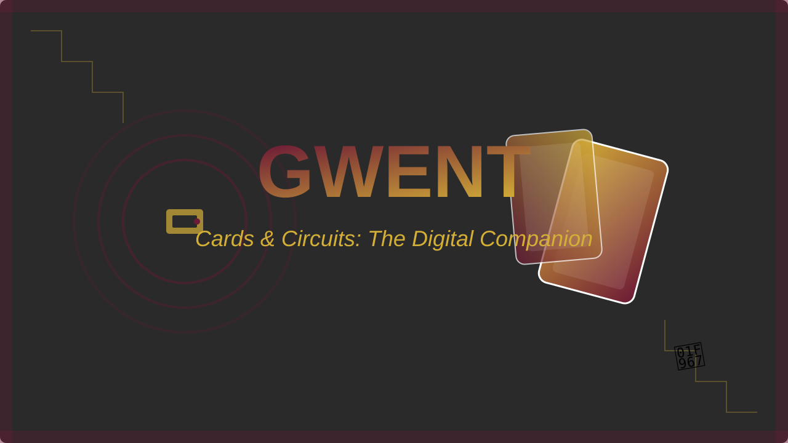
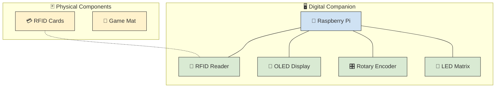
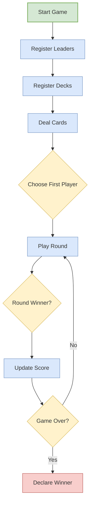
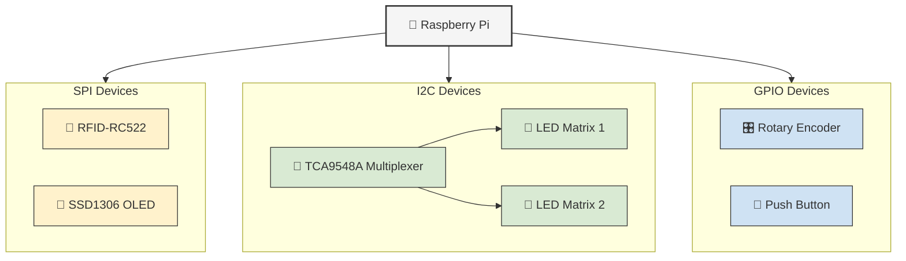
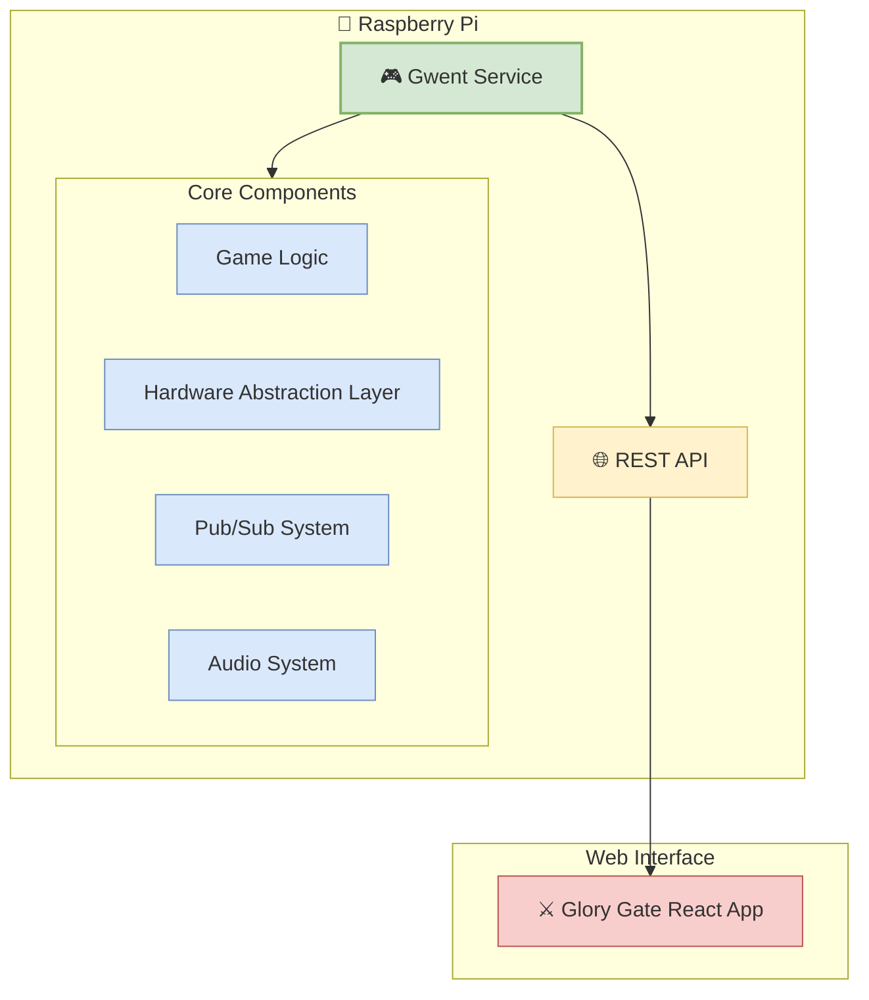
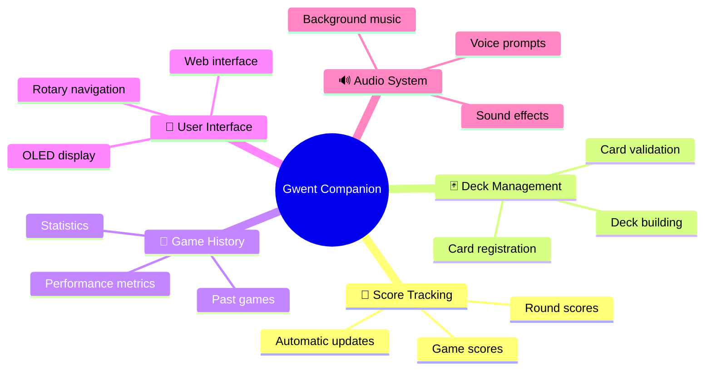
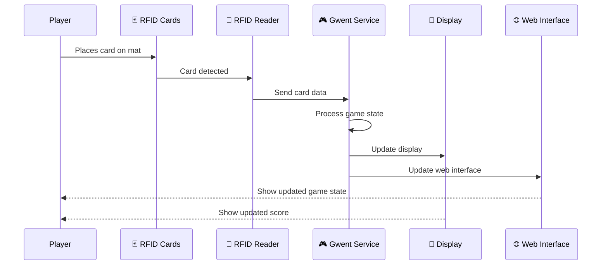
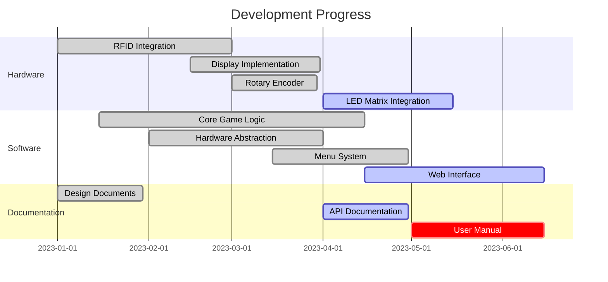
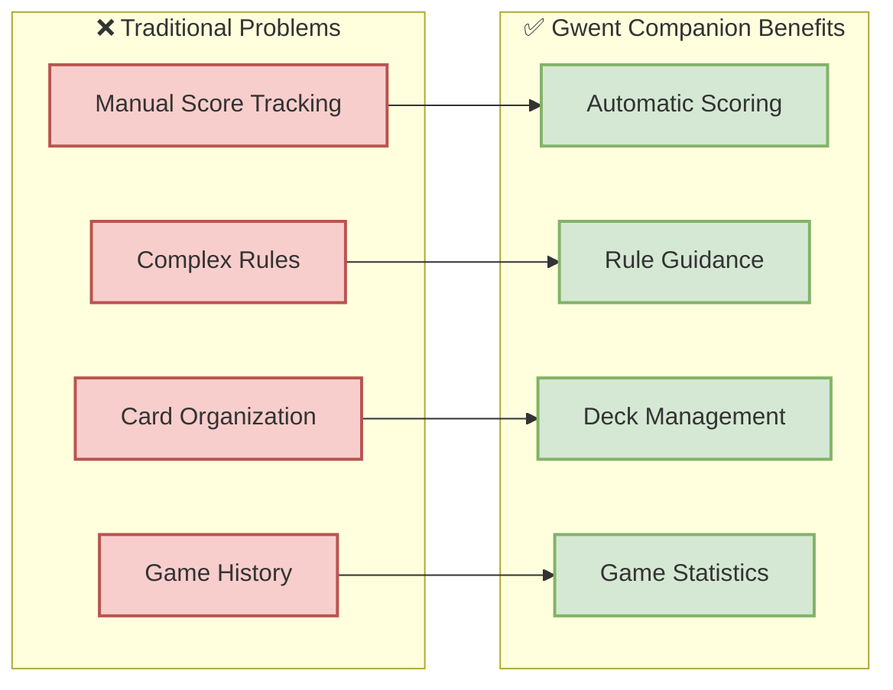
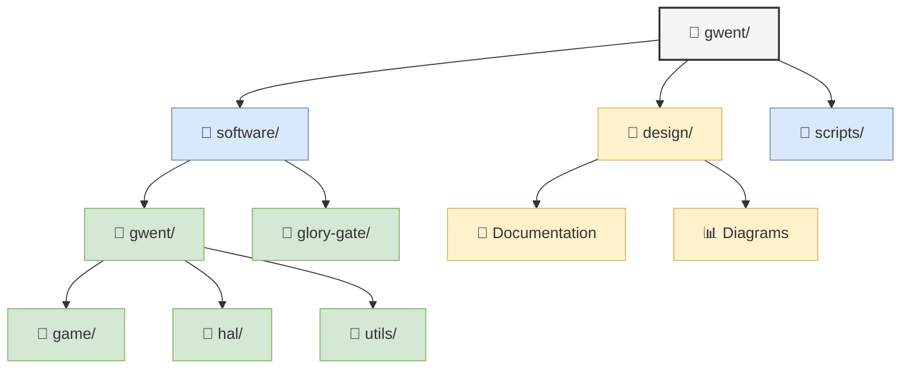

# ☕ Gwent Companion: The Artisanal Card Game Experience 🧙‍♂️

  

A hand-crafted digital companion for the physical card game Gwent from The Witcher III. This project combines locally-sourced physical cards with small-batch digital tracking to enhance the gameplay experience while maintaining the authentic, tactile feel of the original game.

## 🔍 Overview

The Gwent Companion is a digital device that works alongside physical Gwent cards to:
- 🎮 Track game and round scores automatically
- 🃏 Manage player decks
- 💻 Provide a digital interface for game management
- 👐 Maintain the authentic feel of physical card play
- 🧭 Guide players through the entire game process

## 🔌 Hardware Components

- **💳 RFID-Enabled Cards**: Each physical Gwent card contains an RFID chip for identification
- **🧵 Cloth Game Mat**: Traditional playing surface
- **🖥️ Digital Companion**:
  - 🥧 Raspberry Pi for hardware interfacing and game management
  - 📡 Integrated RFID card reader
  - 🔢 Round score display
  - 🏆 Game score display
  - 📱 LCD menu system with interactive navigation
  - 🎛️ Rotary dial for menu navigation and selection
  - ⚡ Power management system

## 💾 Software Components

- **🖥️ Game Server**: Runs on the Raspberry Pi
  - `gwent`: System service application for game state management
    - 🎮 Primary service: Game state management and hardware interfacing
    - 🌐 Secondary service: REST API for external interfaces
- **⚔️ Glory Gate**: React-based Single Page Application
  - Application name: `glory-gate`
  - 🌍 Web-based interface for game management
  - 🔌 Connects to the game server via REST API
  - 🏙️ Named after one of the six gates in Novigrad, connecting Farcorners district to Glory Lane

## ✨ Features

- **🧮 Automatic Score Tracking**: Eliminates manual score keeping
- **🃏 Deck Management**: Track and manage player decks
- **📜 Game History**: Record and review past games
- **📖 Rule Reference**: Quick access to game rules
- **📊 Statistics**: Track win/loss records and performance metrics
- **🧭 Game Guidance**: Step-by-step assistance through the game process
- **📋 Menu System**: Interactive menu system for device configuration and control
- **🌐 Web Interface**: Access game data and controls through Glory Gate

## ⚙️ How It Works

1. 🥧 The Raspberry Pi runs the `gwent` system service that manages the entire game state
2. 🃏 Players use their physical Gwent cards as normal
3. 📡 The companion reads cards via its integrated RFID reader when cards are placed on the mat
4. 🔄 The `gwent` service processes card data and updates the game state
5. 🎛️ The rotary interface allows for easy menu navigation and configuration
6. 📱 The menu system provides access to audio settings and other configuration options
7. 🧭 The `gwent` service guides players through each phase of the game
8. 💾 Game state is maintained throughout the match
9. 🌐 The `gwent` service exposes a REST API that the `glory-gate` React application uses for additional game management features

## 🚧 Project Status

This project is currently in active development. The following components have been implemented:

- **🔌 Hardware Interface**: Physical interface controls including rotary encoder and OLED display
- **🔊 Audio System**: Multi-channel audio playback with background music and sound effects
- **📱 Menu System**: Interactive menu system with navigation and selection via rotary encoder
- **⚙️ Service Management**: Systemd service for automatic startup and management

The design documentation starts with the [Product Requirements Document](design/000-product-requirements.md), which outlines the core requirements and features. See the [task-list.mdc](task-list.mdc) file for current progress and upcoming tasks.

For detailed information about architectural decisions, see the Architecture Decision Records (ADRs):
- [ADR-000](design/ADR/000-task-master-roo-code.md): Task Master Integration for AI-Driven Development
- [ADR-001](design/ADR/001-audio-and-menu-subsystems.md): Audio and Menu Subsystems Implementation
- [ADR-002](design/ADR/002-physical-interface-implementation.md): Physical Interface Implementation with Rotary Encoder and OLED Display

For a comprehensive view of all project documentation, see our [📚 Documentation Table of Contents](toc.md).

## 🤔 Why This Project?

Gwent is a complex card game where score tracking can be cumbersome. This companion device:
- 🃏 Maintains the physical card play experience
- 🧮 Automates tedious score keeping
- 💻 Adds digital features without compromising the game's essence
- 🔰 Makes the game more accessible to new players
- 🧭 Provides guidance through the game process
- 🌐 Offers both physical and web-based interfaces

## 🚀 Getting Started

The project is organized into several key areas:
- 🔌 Hardware design and implementation
- 💻 Software development
  - `gwent` system service
    - 🎮 Game state management
    - 🔌 Hardware interfacing
    - 🌐 REST API implementation
  - `glory-gate` React front-end development

See the [design documentation](design/README.md) for detailed information about each component.

## 📚 Documentation

- [Complete Documentation Table of Contents](toc.md): Comprehensive guide to all project documentation
- [Design Documentation](design/README.md): Artisanal design documentation including architecture decisions, tasks, and specifications
- [Menu System](software/gwent/docs/menu_system.md): Documentation for the interactive menu system
- [Technical Design Documents](design/):
  - 📊 Architecture Diagrams:
    - [GwentPubSub.md](design/GwentPubSub.md): Interactive diagram of the publish-subscribe architecture
    - [GwentPubSub.pdf](design/GwentPubSub.pdf): PDF version of the publish-subscribe architecture
    - [GwentGameStages.pdf](design/GwentGameStages.pdf): Game stages and state transitions
  - 🎭 Style Guidelines:
    - [Design Documentation Style Guide](design/DesignDocumentationStyleGuide.md): Guidelines for creating consistent design documentation
- [Software Components](software/):
  - [Gwent Core](software/gwent/README.md): Main game logic and system service
  - [Glory Gate](software/glory-gate/README.md): React-based web interface
- [Development Tools](scripts/README.md): Scripts and utilities for development
