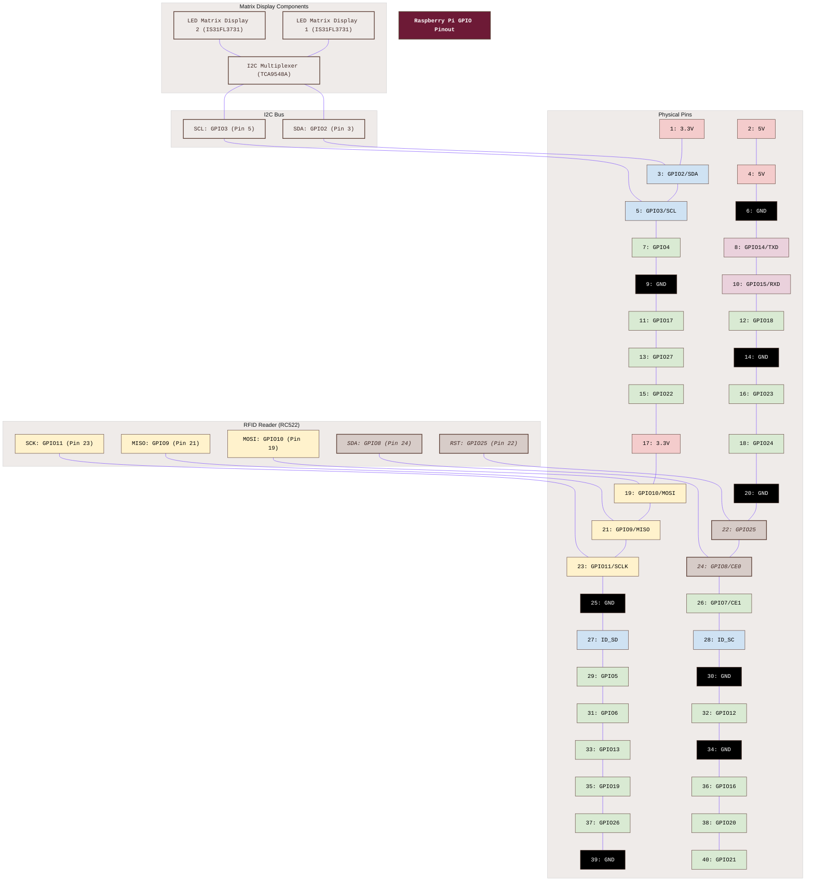

# Gwent Raspberry Pi Development Environment Setup

This document provides instructions for setting up a Raspberry Pi development environment for the Gwent project.

## Prerequisites

- Raspberry Pi 4 (or newer) with at least 2GB RAM
- Raspberry Pi OS (64-bit) installed
- Internet connection
- Connected hardware components (RFID reader, LED matrices, 7" touchscreen, Pi NoIR camera)

## Hardware Components

The Gwent project uses the following hardware components:

1. **RFID Reader (RFID-RC522)**
   - Used for reading RFID-enabled Gwent cards
   - Connected via SPI interface (CE0)

2. **LED Matrix Displays (IS31FL3731)**
   - Three displays: gem/lives + two player scores
   - Connected via I2C interface through a TCA9548A multiplexer

3. **I2C Multiplexer (TCA9548A)**
   - Used to manage the three LED matrix displays
   - Connected via I2C interface

4. **7" Touchscreen + speakers**
   - Runs the `gwent-tui` kiosk (greetd → cage → kitty → gwent-tui, with a `gwent-touch` evdev bridge)
   - All player interaction (assignment, menus, live view) happens here

5. **Pi NoIR Camera (IMX219, CSI)**
   - Owned by the standalone `gwent-camera` service, served over nginx (`/camera/*`)
   - Provides stills, MJPEG stream, and game recordings

> The legacy SSD1306 OLED and rotary encoder have been removed from the build. Their HAL drivers remain in the tree but are disabled (`GWENT_DISABLE_MFD=true`).

## GPIO Pin Connections

Based on the implementation in the `software/gwent/gwent/hal` directory, here are the actual GPIO pin connections used in the code:

| Component | GPIO Pin | Pin Number | Function |
|-----------|---------|------------|----------|
| RFID-RC522 SDA | GPIO8 | Pin 24 | SPI CE0 |
| RFID-RC522 SCK | GPIO11 | Pin 23 | SPI SCLK |
| RFID-RC522 MOSI | GPIO10 | Pin 19 | SPI MOSI |
| RFID-RC522 MISO | GPIO9 | Pin 21 | SPI MISO |
| RFID-RC522 RST | GPIO25 | Pin 22 | Reset |
| I2C SDA | GPIO2 | Pin 3 | I2C data |
| I2C SCL | GPIO3 | Pin 5 | I2C clock |

### Raspberry Pi GPIO Pinout Diagram




**Note:**
- The RFID reader is the only SPI device on the current build (CE0). GPIO17/22/27 (formerly the rotary encoder) and GPIO7/24 + CE1 (formerly the SSD1306 OLED) are now free.
- I2C bus (GPIO2/SDA, GPIO3/SCL) carries the TCA9548A multiplexer, which fans out to the three IS31FL3731 LED Matrix Displays (gems + two player scores).

For a detailed visual reference of the Raspberry Pi GPIO pinout, you can also refer to this image:
[Raspberry Pi GPIO Pinout](https://i0.wp.com/randomnerdtutorials.com/wp-content/uploads/2023/03/Raspberry-Pi-Pinout-Random-Nerd-Tutorials.png?quality=100&strip=all&ssl=1)

## Setup Instructions

### 1. Clone the Repository

```bash
git clone https://github.com/declanshanaghy/gwent.git
cd gwent
```

### 2. Prepare the System

Before running the installation scripts, you need to perform these manual setup steps:

```bash
# Update system packages
sudo apt-get update

# Update Raspberry Pi firmware (recommended)
sudo rpi-update

# Enable SPI & I2C interfaces
sudo raspi-config
# Navigate to "Interface Options" and enable both SPI and I2C

# Add your user to the required groups
sudo usermod -G sudo,gpio,spi,i2c -a ${USER}

# Install SSH public key (if using remote access)
# Place your public key in ~geralt/.ssh/authorized_keys

# Configure sudo without password (optional)
# Add the following line to /etc/sudoers using visudo:
# %sudo  ALL=(ALL) NOPASSWD: ALL

# Create mosquitto user with password "gwent" (hardcoded in the application)
sudo mosquitto_passwd -c /etc/mosquitto/passwd geralt
```

These steps ensure that your Raspberry Pi is properly configured with all the necessary permissions and settings before installing the Gwent application.

### 3. Run the Setup Script

After completing the manual setup steps, run the installation script to set up the environment:

```bash
make install
```

The `make install` command runs the installation scripts that perform the following actions:
- Updates the system packages
- Installs system dependencies
- Installs WiringPi
- Enables SPI and I2C interfaces
- Adds the user to required groups
- Creates a Python virtual environment
- Installs Python packages
- Configures services (MQTT, gwent, gwent-camera, kiosk)
- Sets up the touchscreen kiosk (greetd/cage/kitty) and camera service (nginx + picamera2)
- Creates a convenience script to activate the virtual environment

You can also run specific installation steps:
- `make install-app`: Install just the application
- `make install-system`: Install just the system dependencies

### 4. Reboot the Raspberry Pi

After the setup script completes, reboot the Raspberry Pi to apply all changes:

```bash
sudo reboot
```

### 5. Activate the Virtual Environment

After rebooting, activate the virtual environment:

```bash
source ./activate_gwent.sh
```

### 6. Validate the Install

Run the validation script to verify the install and services:

```bash
bash scripts/validate-gwent.sh
```

Other useful checks:
- `bash scripts/test-touch.sh` — touchscreen / evdev bridge
- `python scripts/test-volume-mixer.py` — audio mixer
- RFID + LED matrices: start the `gwent` service and scan a card; scores light up on the IS31FL3731 matrices
- MQTT broker: `sudo systemctl status mosquitto`

### 7. Run the Gwent Game

Once everything is set up and tested, you can run the Gwent game:

```bash
gwent
```

You can also use the card tools to read and write RFID cards:

```bash
# Read a card
read_card

# Write a card
write_card
```

### 8. Development

The new Gwent implementation is structured as follows:

```
software/gwent/
├── gwent/
│   ├── __init__.py
│   ├── game/
│   │   ├── __init__.py
│   │   ├── main.py
│   │   └── stages/          # DealCards, PlayRound, RoundEnd, GameOver
│   ├── hal/
│   │   ├── __init__.py
│   │   ├── matrix.py        # IS31FL3731 via TCA9548A mux
│   │   ├── rfid.py          # MFRC522 reader/writer
│   │   ├── audio.py / sfx.py
│   │   └── tts/
│   └── messaging/
└── setup.py
```

- `game/`: Game logic and the stage state machine
- `hal/`: Hardware Abstraction Layer (RFID, LED matrices, audio/TTS). Legacy `oled_ssd1306.py`/`rotary*.py`/`mfd*.py` drivers remain but are disabled
- `messaging/`: MQTT message types

For dev iteration without the full kiosk: `bash scripts/dev-server.sh gwent start`.

## Troubleshooting

### SPI and I2C Issues

If you encounter issues with SPI or I2C, make sure they are enabled:

```bash
sudo raspi-config
```

Navigate to "Interface Options" and enable SPI and I2C.

### Permission Issues

If you encounter permission issues, make sure your user is added to the required groups:

```bash
sudo usermod -a -G gpio,spi,i2c,dialout,audio,video $USER
```

Then log out and log back in for the changes to take effect.

### Hardware Connection Issues

If a component is not responding:
1. Check the physical connections
2. Verify the GPIO/I2C pin assignments
3. Check for conflicting GPIO pin usage

### Service Issues

If MQTT services are not running:

```bash
sudo systemctl status mosquitto
```

If they are not running, start them:

```bash
sudo systemctl start mosquitto
```

## Additional Resources

- [Raspberry Pi GPIO Documentation](https://www.raspberrypi.com/documentation/computers/raspberry-pi.html#gpio)
- [SPI Documentation](https://www.raspberrypi.com/documentation/computers/raspberry-pi.html#spi-overview)
- [I2C Documentation](https://www.raspberrypi.org/documentation/hardware/raspberrypi/i2c/README.md)
- [MFRC522 Python Library](https://github.com/declanshanaghy/MFRC522-python/tree/handle_all_sectors)