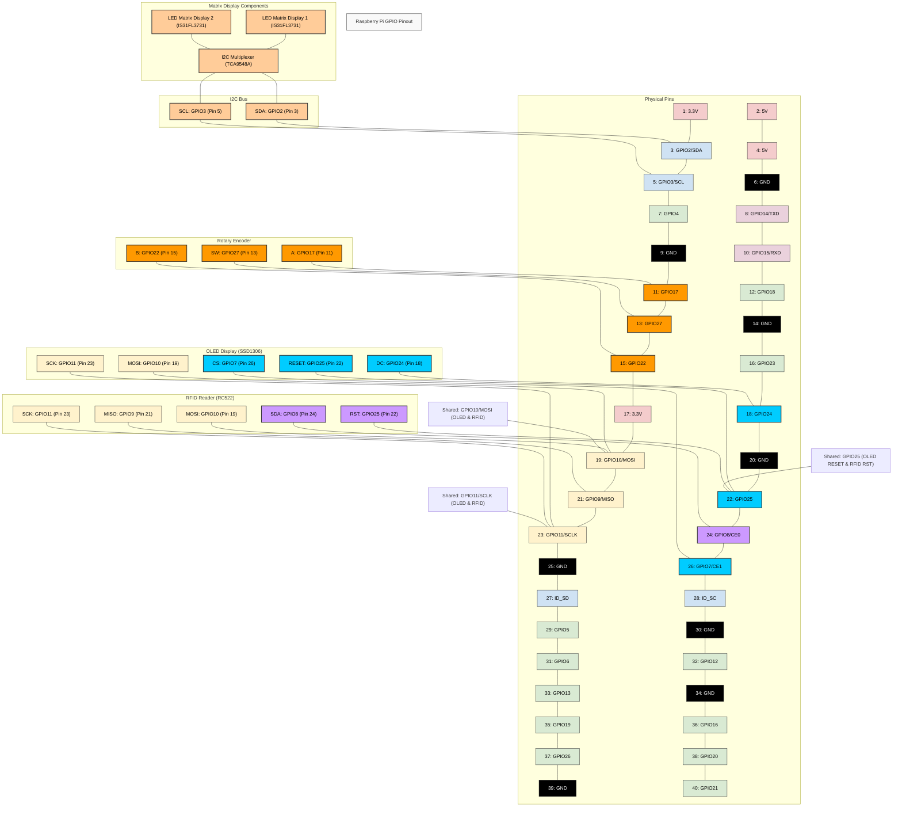

# Gwent Raspberry Pi Development Environment Setup

This document provides instructions for setting up a Raspberry Pi development environment for the Gwent project.

**Note:** The original asyncio-based implementation has been moved to `software/gwent-asyncio`. The new implementation in `software/gwent` is designed to be compatible with the hardware libraries.

## Prerequisites

- Raspberry Pi 3 Model B (or newer) with at least 2GB RAM
- Raspberry Pi OS (64-bit) installed
- Internet connection
- Connected hardware components (RFID reader, OLED display, rotary encoder, etc.)

## Hardware Components

The Gwent project uses the following hardware components:

1. **RFID Reader (RFID-RC522)**
   - Used for reading RFID-enabled Gwent cards
   - Connected via SPI interface

2. **OLED Display (SSD1306)**
   - Used for menu display and user interface
   - Connected via SPI interface

3. **LED Matrix Displays (IS31FL3731)**
   - Used for score display
   - Connected via I2C interface through a multiplexer

4. **I2C Multiplexer (TCA9548A)**
   - Used to manage multiple I2C devices
   - Connected via I2C interface

5. **Rotary Encoder (PEC11 Series)**
   - Used for user input and menu navigation
   - Connected via GPIO pins

## GPIO Pin Connections

Based on the implementation in the `software/gwent/gwent/hal` directory, here are the actual GPIO pin connections used in the code:

| Component | GPIO Pin | Pin Number | Function |
|-----------|---------|------------|----------|
| RFID-RC522 SDA | GPIO8 | Pin 24 | SPI CE0 |
| RFID-RC522 SCK | GPIO11 | Pin 23 | SPI SCLK |
| RFID-RC522 MOSI | GPIO10 | Pin 19 | SPI MOSI |
| RFID-RC522 MISO | GPIO9 | Pin 21 | SPI MISO |
| RFID-RC522 RST | GPIO25 | Pin 22 | Reset |
| Rotary Encoder A | GPIO17 | Pin 11 | Encoder A input |
| Rotary Encoder B | GPIO22 | Pin 15 | Encoder B input |
| Rotary Encoder SW | GPIO27 | Pin 13 | Encoder push button |
| I2C SDA | GPIO2 | Pin 3 | I2C data |
| I2C SCL | GPIO3 | Pin 5 | I2C clock |
| OLED DC | GPIO24 | Pin 18 | OLED data/command |
| OLED CLK | GPIO11 | Pin 23 | SPI clock |
| OLED MOSI | GPIO10 | Pin 19 | SPI MOSI |
| OLED CS | GPIO7 | Pin 26 | SPI chip select (CE1) |
| OLED RESET | GPIO25 | Pin 22 | OLED reset |

### Raspberry Pi GPIO Pinout Diagram




**Note:** The following GPIO pins are shared between components:
- GPIO25 is shared between RFID-RC522 RST and OLED RESET
- SPI bus (GPIO10/MOSI, GPIO11/SCLK) is shared between RFID reader and OLED display
- I2C bus (GPIO2/SDA, GPIO3/SCL) is shared between the I2C Multiplexer and other I2C devices
- The LED Matrix Displays are connected to the I2C Multiplexer (TCA9548A) to allow multiple displays on the same I2C bus

For a detailed visual reference of the Raspberry Pi GPIO pinout, you can also refer to this image:
[Raspberry Pi GPIO Pinout](https://i0.wp.com/randomnerdtutorials.com/wp-content/uploads/2023/03/Raspberry-Pi-Pinout-Random-Nerd-Tutorials.png?quality=100&strip=all&ssl=1)

## Setup Instructions

### 1. Clone the Repository

```bash
git clone https://github.com/declanshanaghy/gwent.git
cd gwent
```

### 2. Run the Setup Script

The setup script will install all necessary dependencies, configure the system, and set up the Python environment.

```bash
make install
```

The `make install` command runs the installation scripts that perform the following actions:
- Updates the system packages
- Installs system dependencies
- Installs WiringPi
- Enables SPI and I2C interfaces
- Adds the user to required groups
- Creates a Python virtual environment
- Installs Python packages
- Configures services (MQTT, Redis)
- Creates a hardware test script
- Creates a convenience script to activate the virtual environment

You can also run specific installation steps:
- `make install-app`: Install just the application
- `make install-system`: Install just the system dependencies

### 3. Reboot the Raspberry Pi

After the setup script completes, reboot the Raspberry Pi to apply all changes:

```bash
sudo reboot
```

### 4. Activate the Virtual Environment

After rebooting, activate the virtual environment:

```bash
source ./activate_gwent.sh
```

### 5. Test the Hardware

Run the hardware test script to verify that all components are working correctly:

```bash
python ./test_hardware.py
```

The test script will check:
- GPIO functionality
- SPI interface
- I2C interface
- RFID reader
- OLED display
- Rotary encoder
- MQTT broker
- Redis server

### 6. Run the Gwent Game

Once everything is set up and tested, you can run the Gwent game:

```bash
gwent
```

You can also use the card tools to read and write RFID cards:

```bash
# Read a card
read_card

# Write a card
write_card
```

### 7. Development

The new Gwent implementation is structured as follows:

```
software/gwent/
├── gwent/
│   ├── __init__.py
│   ├── game/
│   │   ├── __init__.py
│   │   ├── main.py
│   │   └── card_tools.py
│   ├── hal/
│   │   ├── __init__.py
│   │   ├── display.py
│   │   ├── rfid.py
│   │   └── rotary.py
│   └── utils/
│       └── __init__.py
└── setup.py
```

- `game/`: Contains the game logic
- `hal/`: Hardware Abstraction Layer for interfacing with hardware components
- `utils/`: Utility functions and helpers

## Troubleshooting

### SPI and I2C Issues

If you encounter issues with SPI or I2C, make sure they are enabled:

```bash
sudo raspi-config
```

Navigate to "Interface Options" and enable SPI and I2C.

### Permission Issues

If you encounter permission issues, make sure your user is added to the required groups:

```bash
sudo usermod -a -G gpio,spi,i2c,dialout,audio,video $USER
```

Then log out and log back in for the changes to take effect.

### Hardware Connection Issues

If the hardware test script reports issues with specific components:
1. Check the physical connections
2. Verify the GPIO pin assignments
3. Check for conflicting GPIO pin usage

### Service Issues

If MQTT or Redis services are not running:

```bash
sudo systemctl status mosquitto
sudo systemctl status redis-server
```

If they are not running, start them:

```bash
sudo systemctl start mosquitto
sudo systemctl start redis-server
```

## Additional Resources

- [Raspberry Pi GPIO Documentation](https://www.raspberrypi.com/documentation/computers/raspberry-pi.html#gpio)
- [SPI Documentation](https://www.raspberrypi.com/documentation/computers/raspberry-pi.html#spi-overview)
- [I2C Documentation](https://www.raspberrypi.org/documentation/hardware/raspberrypi/i2c/README.md)
- [MFRC522 Python Library](https://github.com/declanshanaghy/MFRC522-python/tree/handle_all_sectors)
- [Luma.OLED Documentation](https://luma-oled.readthedocs.io/)