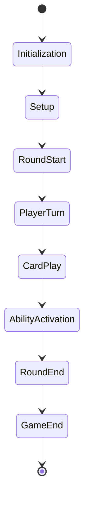

# Game State Management Specification

## 1. State Overview

### 1.1 Game States
- Initialization
- Setup
- Round Start
- Player Turn
- Card Play
- Ability Activation
- Round End
- Game End

### 1.2 State Transitions
```
Initialization -> Setup -> Round Start -> Player Turn -> Card Play -> Ability Activation -> Round End -> Game End
```

## 2. State Data

### 2.1 Game Data
- Game ID
- Players
- Rounds
- Scores
- History
- Settings

### 2.2 Player Data
- Player ID
- Deck
- Hand
- Graveyard
- Score
- Status

## 3. State Machine

### 3.1 States


### 3.2 Transitions
- Valid moves
- Invalid moves
- Timeouts
- Concessions
- Errors

## 4. State Persistence

### 4.1 Storage
- SQLite database
- In-memory cache
- Backup files
- Recovery points
- Transaction logs

### 4.2 Recovery
- State restoration
- Error recovery
- Conflict resolution
- Data validation
- Consistency checks

## 5. State Updates

### 5.1 Triggers
- Player actions
- Card effects
- Ability activations
- Round transitions
- Game events

### 5.2 Processing
- Validation
- Calculation
- Update
- Notification
- Persistence

## 6. State Validation

### 6.1 Rules
- Game rules
- Card rules
- Ability rules
- Round rules
- Victory conditions

### 6.2 Checks
- Move validity
- Card legality
- Ability timing
- Score accuracy
- State integrity

## 7. State Communication

### 7.1 Updates
- Real-time
- Batch
- Event-based
- Polling
- Push

### 7.2 Formats
- JSON
- Protocol Buffers
- Binary
- Text
- Custom

## 8. State Monitoring

### 8.1 Metrics
- State changes
- Update frequency
- Validation time
- Storage size
- Recovery time

### 8.2 Logging
- State transitions
- Validation results
- Update details
- Error conditions
- Recovery attempts

## 9. State Testing

### 9.1 Unit Tests
- State transitions
- Validation rules
- Update logic
- Recovery procedures
- Error handling

### 9.2 Integration Tests
- State persistence
- Communication
- Validation
- Recovery
- Performance

## 10. State Optimization

### 10.1 Performance
- State size
- Update speed
- Validation efficiency
- Storage optimization
- Communication overhead

### 10.2 Reliability
- Error handling
- Recovery speed
- Data integrity
- Consistency
- Availability 