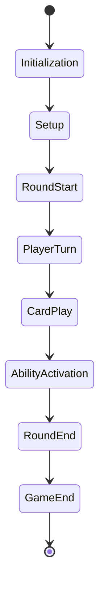
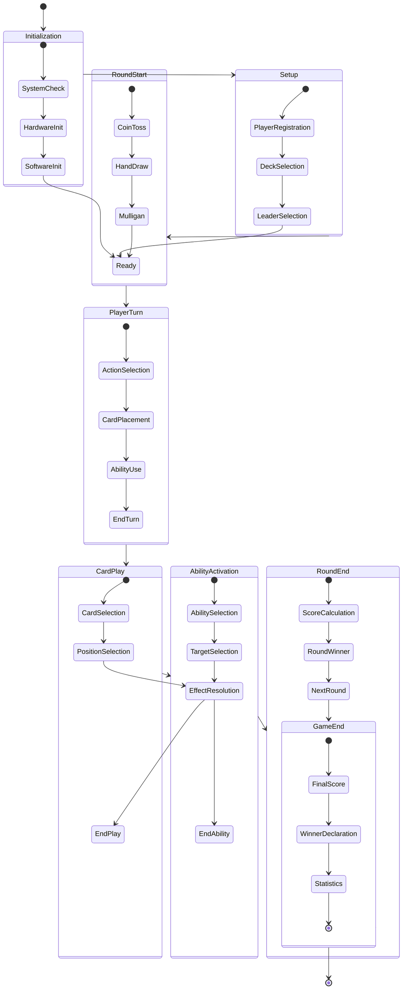

# State Machine Design Specification

## 1. State Diagram

### 1.1 Overview


### 1.2 Detailed States


## 2. State Definitions

### 2.1 Initialization States
- SystemCheck
  - Hardware verification
  - Software verification
  - Network check
  - Database connection
- HardwareInit
  - RFID reader setup
  - Display initialization
  - Input device setup
  - Power management
- SoftwareInit
  - Service startup
  - API initialization
  - Database setup
  - Cache warmup

### 2.2 Setup States
- PlayerRegistration
  - Player identification
  - Profile loading
  - Statistics retrieval
  - Settings application
- DeckSelection
  - Deck validation
  - Card counting
  - Faction check
  - Leader compatibility
- LeaderSelection
  - Leader validation
  - Ability setup
  - Faction bonus
  - Special rules

## 3. Transition Rules

### 3.1 Conditions
- Valid moves
- Invalid moves
- Timeouts
- Concessions
- Errors

### 3.2 Actions
- State validation
- Data update
- Event generation
- Notification
- Logging

## 4. State Data

### 4.1 Game State
- Game ID
- Players
- Rounds
- Scores
- History
- Settings

### 4.2 Player State
- Player ID
- Deck
- Hand
- Graveyard
- Score
- Status

## 5. Error Handling

### 5.1 Error States
- Invalid transition
- Data corruption
- Timeout
- Connection loss
- Hardware failure

### 5.2 Recovery
- State rollback
- Data validation
- Reconnection
- Retry logic
- Fallback procedures

## 6. Implementation

### 6.1 Code Structure
```go
type StateMachine struct {
    currentState State
    states       map[State]StateHandler
    transitions  map[State][]Transition
}

type StateHandler interface {
    Enter()
    Exit()
    HandleEvent(Event) error
}

type Transition struct {
    fromState State
    toState   State
    condition func() bool
    action    func() error
}
```

### 6.2 State Handlers
- InitializationHandler
- SetupHandler
- RoundStartHandler
- PlayerTurnHandler
- CardPlayHandler
- AbilityActivationHandler
- RoundEndHandler
- GameEndHandler

## 7. Testing

### 7.1 Unit Tests
- State transitions
- Validation rules
- Error handling
- Recovery procedures
- Performance

### 7.2 Integration Tests
- State persistence
- Communication
- Validation
- Recovery
- Performance

## 8. Monitoring

### 8.1 Metrics
- State changes
- Transition time
- Error rate
- Recovery time
- State size

### 8.2 Logging
- State transitions
- Validation results
- Error conditions
- Recovery attempts
- Performance data

## 9. Optimization

### 9.1 Performance
- State size
- Transition speed
- Memory usage
- CPU utilization
- I/O operations

### 9.2 Reliability
- Error handling
- Recovery speed
- Data integrity
- Consistency
- Availability

## 10. Documentation

### 10.1 State Diagrams
- Overview diagram
- Detailed diagrams
- Transition tables
- Error states
- Recovery paths

### 10.2 API Documentation
- State interface
- Transition rules
- Error codes
- Recovery procedures
- Performance metrics 