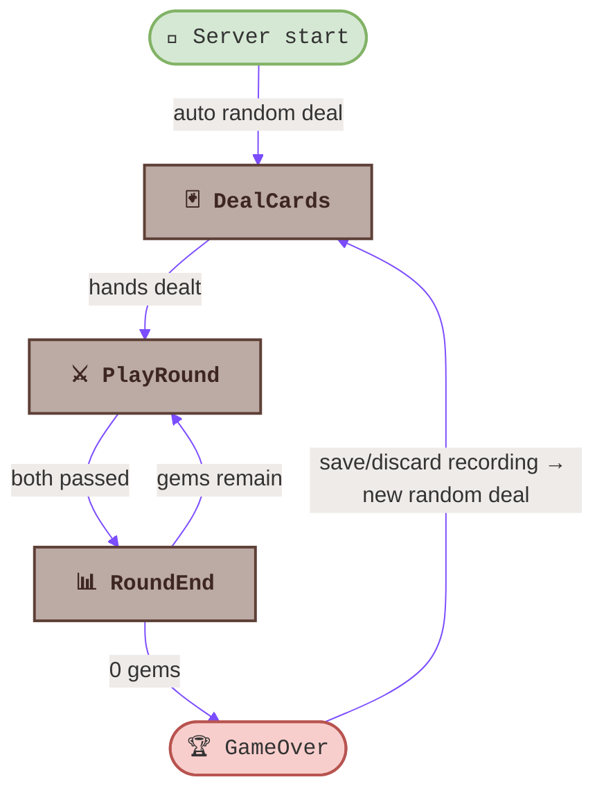
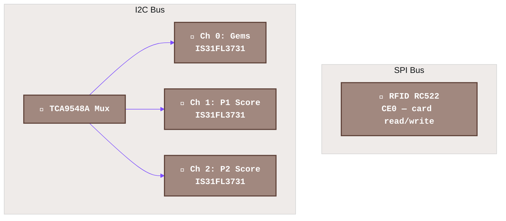
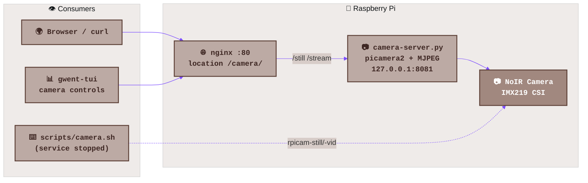
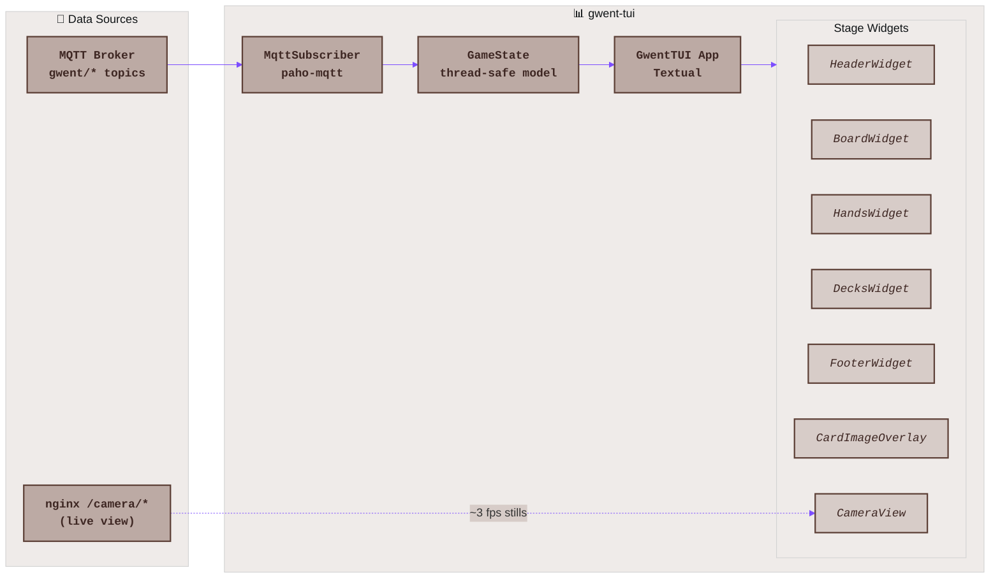
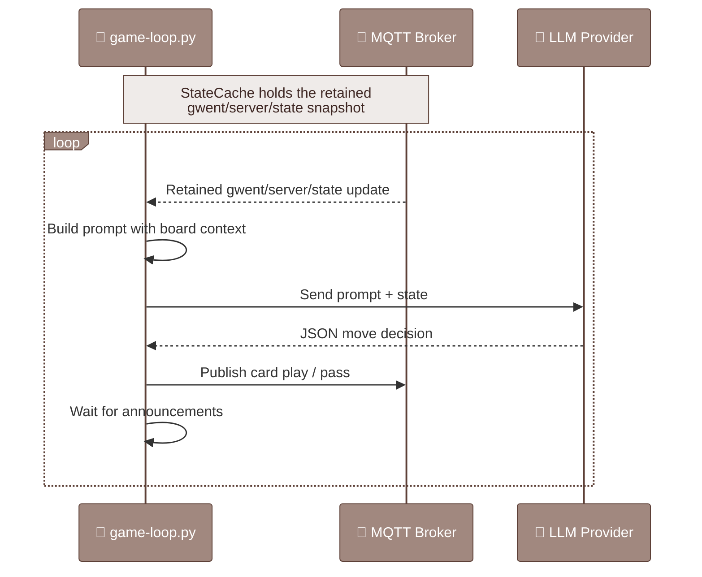
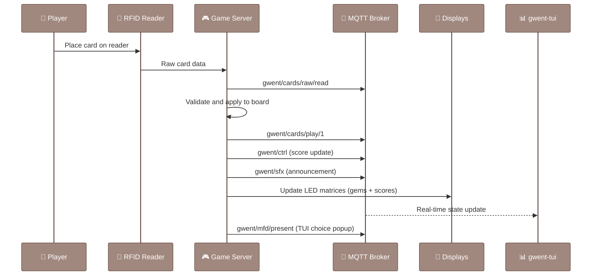

# Gwent Companion Architecture

This document is the comprehensive reference for the Gwent Companion system architecture. For specific subsystem details, see the linked documents throughout.

## System Overview

The Gwent Companion is a multi-process system centered on an MQTT message broker. The game server owns all game state and hardware; observers and drivers connect over MQTT. Player interaction happens through the 7" touchscreen kiosk running `gwent-tui` (greetd → cage → kitty), the RFID reader, and the LED matrices; the camera is served separately over HTTP.

```mermaid
%%{init: {
  'theme': 'base',
  'themeVariables': {
    'primaryColor': '#6d1a36',
    'primaryTextColor': '#333',
    'primaryBorderColor': '#7C4DFF',
    'lineColor': '#7C4DFF',
    'secondaryColor': '#D7CCC8',
    'tertiaryColor': '#EFEBE9',
    'fontFamily': 'Courier New',
    'fontSize': '16px'
  }
}}%%

flowchart TD
    subgraph pi["🥧 Raspberry Pi"]
        subgraph server["🎮 Game Server (gwent)"]
            controller["⚙️ Controller\nStage Machine"]
            hal["🔧 HAL\nHardware Abstraction"]
            pubsub["📨 PubSub\nMQTT Client"]
            sfx["🎵 Audio / TTS"]
        end

        broker["📡 Mosquitto\nMQTT Broker\nport 1883"]

        camserver["📷 Camera Server\ngwent-camera\npicamera2 :8081"]
        nginx["🌐 nginx\nport 80\n/camera/*"]

        subgraph hw["🔧 Hardware"]
            rfid["📡 RFID RC522\nSPI CE0"]
            mux["🔌 TCA9548A\nI2C Mux"]
            gems["💎 Gem Display\nIS31FL3731 Ch0"]
            score1["🔢 P1 Score\nIS31FL3731 Ch1"]
            score2["🔢 P2 Score\nIS31FL3731 Ch2"]
            cam["📷 NoIR Camera\nIMX219 CSI"]
            touch["🖐️ 7\" Touchscreen\n+ speakers"]
        end
    end

    subgraph external["👁️ Kiosk + Clients"]
        tui["📊 gwent-tui\nTouchscreen Kiosk"]
        gameloop["🤖 game-loop.py\nLLM Orchestrator"]
        browser["🌍 Browser / curl\n/camera/still|stream"]
    end

    subgraph data["📁 Data"]
        cards["🃏 Card JSONs\nby faction"]
    end

    controller <--> pubsub
    controller --> hal
    controller --> sfx
    hal --> rfid
    hal --> mux
    mux --> gems
    mux --> score1
    mux --> score2
    pubsub <--> broker

    broker <--> tui
    broker <--> gameloop
    tui --- touch

    camserver --> cam
    nginx --> camserver
    browser --> nginx
    tui --> nginx

    controller --> cards

    classDef hardware fill:#A1887F,stroke:#5D4037,stroke-width:2px,color:#fff,font-family:'Courier New',font-weight:bold
    classDef software fill:#BCAAA4,stroke:#5D4037,stroke-width:2px,color:#3E2723,font-family:'Courier New',font-weight:bold
    classDef data fill:#D7CCC8,stroke:#5D4037,stroke-width:2px,color:#3E2723,font-family:'Courier New',font-style:italic

    class rfid,mux,gems,score1,score2,cam,touch hardware
    class controller,hal,pubsub,sfx,broker,tui,gameloop,camserver,nginx,browser software
    class cards data
```

## Server Internals

The game server (`software/gwent/`) is a single Python process running as the `gwent` systemd service. Entry point: `gwent.game.main:run`.

### Startup Sequence

1. Configure logging
2. Initialize MQTT client (connect to Mosquitto broker)
3. Create components: Controller, RoundKeeper, the two Players (each bound to a TCA9548A mux channel for its LED score matrix), the RFID card Reader, SFX/TTS, the MenuPublisher and LLMPlayerManager, the StatePublisher, and the ServerCommandHandler
4. Initialize hardware via HAL (SPI lock, I2C mux + IS31FL3731 matrices, RFID reader). The MFD (OLED + rotary encoder) component is skipped when `GWENT_DISABLE_MFD=true` — the kiosk build has no OLED or rotary, so this is always set in `gwent.service`
5. Initialize the Controller with all game stages
6. Enter main loop — block on MQTT message dispatch until SIGTERM

There is no HTTP server in the game server process; all I/O is over MQTT (see *Command & control* below).

### Game Stages State Machine

The `Controller` class manages a state machine of `GameStage` subclasses. Each stage subscribes to relevant MQTT topics, processes events, and calls its `complete` callback to advance to the next stage.



There is **no main-menu / choice screen**: the server deals a fresh random game at startup, after every Game Over, and on the in-game menu's *Quit Game* (reset). The `RegisterLeaders`/`RegisterDecks` stages still exist in code but are no longer reachable from the normal flow.

Stage implementations live in `software/gwent/gwent/game/stages/`. For detailed flow diagrams within each stage, see [GwentGameStages.md](GwentGameStages.md).

### Pub/Sub System

All inter-component communication uses MQTT via the Mosquitto broker. The `PubSubComponent` base class (in `gwent.game.__init__`) wraps `paho-mqtt` and provides `publish()` / `subscribe()` methods with automatic message serialization through a factory pattern.

Message types are defined in `gwent.messaging.*`:

| Module | KIND | Purpose |
|--------|------|---------|
| `card` | `card` | Raw card scan data from RFID |
| `card_play` | `card_play` | Card played onto the board |
| `ctrl` | `ctrl` | Stage transitions and game control |
| `choice` | `choice` | Interactive-pick selections (sent back by the TUI choice popup) |
| `mfd` | `mfd` | Multi-function-display content (present/choose). Originally driven an OLED + rotary; with that hardware removed, the TUI renders `mfd/present` as a choice popup and replies on `mfd/choose` |
| `sfx` | `sfx` | Sound effect and TTS triggers |

For the full pub/sub diagram, see [GwentPubSub.md](GwentPubSub.md).

### MQTT Topic Structure

All topics are rooted under `gwent/`:

```
gwent/
  server/
    state                 # Retained full game-state snapshot (QoS 1) — out
    presence              # online/offline, retained, with LWT
  ctrl/
    players               # Set player names/pronouns — in
    client-tts            # Register a client TTS provider — in
  cards/
    raw/read              # Raw RFID card scan data
    play/PLAYER.ONE       # Card played by player 1
    play/PLAYER.TWO       # Card played by player 2
  mfd/
    present               # Interactive-pick content (rendered by the TUI popup)
    choose                # Pick reply (sent by the TUI; was the rotary)
  menu/
    present/{menu_id}     # Retained menu mirror (assign-p1/2 controller pickers)
    choose                # Menu selection reply
  game/start              # Client deck-pair start handler (no live UI sends here) — in
  sfx                     # Sound effect and TTS triggers
  sfx/complete            # Announcement completion acknowledgments
  music                   # Music playback + music/ctrl, music/complete
  toast                   # Transient status banners (not retained)
```

The broker uses authenticated access (user: `geralt`, password: `gwent`).
Canonical topic definitions live in `software/gwent-shared/gwent_shared/topics.py`.

### Command & control (MQTT)

State and commands run entirely over MQTT — there is no HTTP API.

| Direction | Topic | Description |
|-----------|-------|-------------|
| server → clients | `gwent/server/state` | Full game-state snapshot, retained (QoS 1). Republished on every change, deduped by content hash. New subscribers get it instantly. |
| server → clients | `gwent/server/presence` | `online`/`offline`, retained, with LWT. |
| client → server | `gwent/ctrl/players` | Set player names/pronouns |
| client → server | `gwent/ctrl/client-tts` | Register a client TTS provider |

Implementation: `state_publisher.py` (publish), `server_commands.py` (commands),
`session_config.py` (shared player/tts state).

### Hardware Abstraction Layer

The HAL isolates hardware-specific code behind clean interfaces. On the current kiosk build the RFID reader is the only SPI device, so the shared SPI bus lock (`threading.RLock`) is effectively a no-op — it exists to serialize the RFID reader against the (now removed) OLED if MFD hardware is ever re-enabled.



Key HAL modules:

| Module | File | Devices |
|--------|------|---------|
| RFID | `hal/rfid.py`, `hal/mfrc522_entrypoints.py` | MFRC522 reader/writer (SPI CE0) |
| LED Matrices | `hal/matrix.py` | IS31FL3731 gem + 2 score displays via TCA9548A I2C mux |
| Audio | `hal/audio.py` | pygame-based sound playback |

Legacy MFD hardware drivers (`hal/oled_ssd1306.py`, `hal/mfd.py`, `hal/mfdi.py`, `hal/rotary.py`, `hal/rotary_pigpio.py`) remain in the tree but are **not loaded** on the kiosk build: the SSD1306 OLED and rotary encoder have been physically removed, and `GWENT_DISABLE_MFD=true` in `gwent.service` skips the MFD component entirely. The interactive-pick flow they served is now rendered by the TUI (see *Command & control* and the TUI section).

## Camera Subsystem

A Pi NoIR camera (IMX219, CSI ribbon port) is part of the physical build, giving the companion eyes on the table. It is deliberately **not** part of the game server's HAL — a separate `gwent-camera` systemd service owns the camera continuously and exposes it over HTTP, so the game server, TUI, and any browser can consume it without device contention.

> **NoIR tuning**: the module has no IR-cut filter, so the stock sensor tuning renders everything magenta from infrared contamination. Every consumer must use the `imx219_noir.json` libcamera tuning file — both `camera-server.py` and `scripts/camera.sh` default to it.



### HTTP Endpoints

nginx (port 80, `0.0.0.0`) reverse-proxies to `camera-server.py` on `127.0.0.1:8081` and serves recordings straight off disk:

| Endpoint | Returns | Notes |
|----------|---------|-------|
| `GET /camera/still` | Single JPEG frame (1280×960) | Snapshot of the live feed; safe while streaming/recording |
| `GET /camera/stream` | MJPEG (`multipart/x-mixed-replace`) | Unbounded live stream; nginx proxies it unbuffered |
| `GET /camera/recordings/` | Autoindex of `tmp/recordings/{unconfirmed,saved}/` | Browse + download game recordings (mp4) |

The server holds one MJPEG encoder (hardware, vc4) on a 1280×960 4:3 video configuration — full sensor field of view, simultaneous stills and streams, multiple concurrent stream clients.

### MQTT Control Plane

`camera-server.py` is also an MQTT client; the game server and TUI never touch the camera device directly:

| Direction | Topic | Payload |
|-----------|-------|---------|
| in | `gwent/camera/ctrl` | `{action: on\|off\|record-start\|record-stop\|save\|discard\|evict-saved, game_id, bytes_needed, timestamp}` |
| out (retained) | `gwent/camera/state` | `{online, camera_on, recording, current_file, recordings:[{file,size,saved,url_path,mtime}], bytes_used, bytes_budget, headroom_ok, timestamp}` |

The retained state means clients re-sync instantly after restarts; `camera_on` itself also persists across camera-service restarts (flag file `tmp/recordings/.camera-on`).

### Game Recording

While the camera is ON, every game is recorded: H.264 (vc4 hardware) 1280×960@30 at **3 Mbps** (~22.5 MB/min, ~0.68 GB per 30-min game) into a fragmented MP4 (`-movflags +frag_keyframe+empty_moov` — playable even after a crash). The H264 encoder attaches/detaches on the live camera alongside the MJPEG stream encoder.

**Lifecycle** — recording starts in `Controller.start_deal_cards` (the single choke point for all game-start routes), stops on GameOver entry. The Game Over prompt then doubles as the save question ("Save Recording" / cancel = discard). Saved files move `unconfirmed/` → `saved/`; discarded/abandoned/reset games leave the file in `unconfirmed/`.

**Disk budget (ring buffer)** — recordings live in `tmp/recordings/` capped at **10 GiB** (of ~17 GB free), with **1.5 GiB headroom** (one long game) required before a new recording. No time-based TTL — recordings live as long as space allows:

1. At record-start the camera service silently deletes the **oldest unconfirmed** recordings until headroom holds.
2. If saved recordings alone block the headroom, the game server prompts the user in the TUI — listing the oldest saved files **with their `/camera/recordings/saved/...` download URLs** — and deletes them only on confirmation ("Delete & Record"). Declining starts the game *without* recording; **a game is never blocked by storage**.
3. An hourly cron (`/etc/cron.d/gwent-camera` → `scripts/camera-recordings-cleanup.py`) enforces the 10 GiB cap as a backstop, deleting oldest unconfirmed only — never `saved/`.

### Components

| Component | File | Role |
|-----------|------|------|
| Camera server | `scripts/camera-server.py` | picamera2 HTTP + MQTT server; owns the camera + recording lifecycle; logs to `tmp/logs/camera-server.log` + journald |
| Budget logic | `scripts/camera_recordings.py` | Pure-stdlib recordings manager (list/evict/save, budget math) shared by server + cron |
| Cron janitor | `scripts/camera-recordings-cleanup.{py,sh}` + `scripts/gwent-camera-cron` | Hourly 10 GiB cap enforcement; logs to `tmp/logs/camera-recordings-cleanup.log` |
| Game-server bridge | `software/gwent/gwent/game/camera_client.py` | `CameraClient` — menu toggle backend, record start/stop hooks, Game Over save, eviction prompt. Fail-soft: camera service down ⇒ games proceed unrecorded |
| TUI live view | `software/gwent-tui/gwent_tui/widgets/camera_view.py` | Floating corner panel polling `/still` ~3 fps via kitty graphics; `⏺ REC` / `📷 LIVE` border title; tap to hide |
| systemd unit | `scripts/gwent-camera.service` | Runs the server as user `dshanaghy` (system python3 — picamera2/paho are apt packages, not in the venv) |
| nginx site | `scripts/nginx-camera.conf` | `default_server` on :80; `proxy_buffering off` for the MJPEG stream; recordings alias + autoindex |
| CLI tool | `scripts/camera.sh` | `--still` (rpicam-still + chafa inline render) and `--stream` (rpicam-vid + mpv `--vo=tct`) for ad-hoc use |
| Install | `scripts/install-system.sh` | Installs `nginx-light`, `python3-picamera2`, `python3-paho-mqtt`, `rpicam-apps`, `chafa`, `mpv`; nginx site, cron, recordings dirs, www-data ACL; enables both services |

**Device ownership**: only one process can hold the camera. While `gwent-camera` runs, `scripts/camera.sh` fails with "camera busy" — either hit the HTTP endpoints instead, or `sudo systemctl stop gwent-camera` first.

### TUI Integration

Camera controls live in the TUI's in-game **hamburger menu** (☰), publishing `gwent/camera/ctrl` directly:

- **Camera On/Off** 🎥 — gates game recording (and live-view availability). State persists across restarts.
- **Live View Show/Hide** 👁 — only shows/hides the floating panel; **recording is never affected**. Hidden by default on every camera-service start.

While shown, `CameraView` floats on the corner layer (defaults bottom-right) rendering ~3 fps stills via the kitty graphics protocol (same `textual-image` path as card overlays) and is **draggable** — press/touch and move it anywhere; the position is kept for the session. Border title shows `⏺ REC` while a game records, `📷 LIVE` otherwise.

Longer term, the camera feeds card identification (`id-and-chip-card`) and table-state capture without a separate USB webcam.

## TUI Architecture

The terminal dashboard (`software/gwent-tui/`) is built with [Textual](https://textual.textualize.io/) (Rich-based TUI framework). It provides a real-time view of the game state without touching any hardware.



### Data Flow

1. **MqttSubscriber** connects to the broker and subscribes to the retained full game-state snapshot (`gwent/server/state`, QoS 1) plus `gwent/ctrl`, `gwent/mfd/*`, `gwent/menu/present/+`, `gwent/sfx`, `gwent/cards/*`, `gwent/server/presence`, `gwent/camera/state`, and `gwent/toast`
2. The retained `gwent/server/state` snapshot replaces the old HTTP `GET /state` long-poll — new subscribers get the full state instantly, and every server-side change republishes it
3. Messages feed into the thread-safe **GameState** model
4. The **GwentTUI** Textual app swaps stage-specific widget sets (matching the server's stage machine) and updates the display on each state change. The floating **CameraView** panel separately polls nginx `/camera/still` for the live view

Stage widgets in `gwent_tui/stages/` cover the reachable server stages: `DealCards`, `PlayRound`, `RoundEnd`, `RoundSummary`, `GameOver`, plus `Offline`/`Unknown` fallbacks. The `main_menu`, `register_leaders`, `register_decks`, and `wizard` widgets remain in the tree but are no longer reached — the server always has a game in progress and never publishes a main menu; all menu interaction is via TUI-local hamburger modals.

The TUI also handles client-side TTS (announcing game events through local speakers) and publishes `sfx/complete` back to the broker when announcements finish.

## Game-Loop Orchestration

The LLM-vs-LLM orchestrator (`.claude/skills/llm-vs/scripts/game-loop.py`) automates full games between two AI models.



### Supported Providers

| Provider | Prefix | Example Aliases |
|----------|--------|-----------------|
| Anthropic | `anthropic/` | `sonnet`, `haiku`, `opus` |
| OpenAI | `openai/` | `gpt-4o`, `o3-mini` |
| Google Gemini | `gemini/` | `flash`, `pro` |
| Ollama (local) | `ollama/` | `deepseek`, `llama3` |

The orchestrator reads game state from the retained `gwent/server/state` MQTT snapshot (via a `StateCache` subscriber), constructs a system prompt with full Gwent rules and board context, sends it to the selected LLM, parses the JSON response, and publishes the move via MQTT (`mosquitto_pub`). An `AnnouncementSync` listener waits for TTS completion before proceeding to the next turn.

## Data Model

### Cards

Card definitions are JSON files organized by faction in `software/data/cards/{Faction}/`:

```
software/data/cards/
  Monsters/           # Arachas, Fiend, Crones, etc.
  Nilfgaardian/       # Emhyr, Fringilla, spies, etc.
  NorthernRealms/     # Foltest, Blue Stripes, etc.
  Scoiatael/          # Francesca, Dwarves, etc.
  Skellige/           # Cerys, Berserkers, etc.
  Neutral/            # Geralt, Yennefer, weather cards
```

Each card JSON contains: `name`, `faction`, `strength`, `ranges` (combat rows), `abilities`, `starter` flag, `rfid` tag ID, optional `image` path and `card_text`.

For full card mechanics, see [GwentRules.md](GwentRules.md) and [GwentCardMechanics.md](GwentCardMechanics.md).

### Decks

Saved player decks in `software/data/decks/`. Each deck file references cards by name and faction.

## Message Flow Example

A typical card play flows through the system like this:



## Related Documents

- [GwentRules.md](GwentRules.md) -- canonical game rules
- [GwentGameStages.md](GwentGameStages.md) -- detailed stage flow diagrams
- [GwentPubSub.md](GwentPubSub.md) -- full pub/sub architecture diagram
- [GwentCardMechanics.md](GwentCardMechanics.md) -- card specialties and abilities
- [GwentLeaders.md](GwentLeaders.md) -- leader abilities
- [GwentFactions.md](GwentFactions.md) -- faction passive abilities
- [000-product-requirements.md](000-product-requirements.md) -- original PRD
- [MermaidStyleGuide.md](MermaidStyleGuide.md) -- diagram styling conventions
