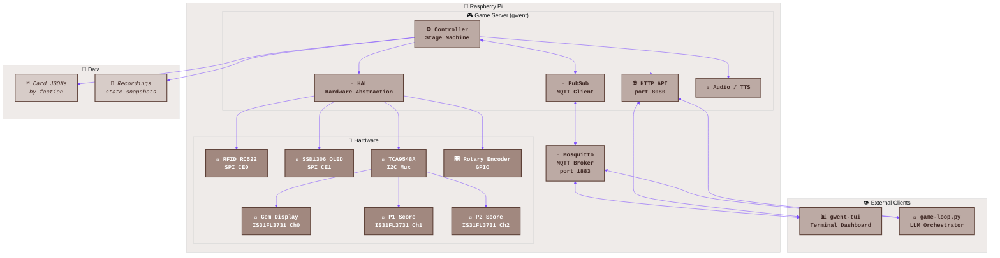
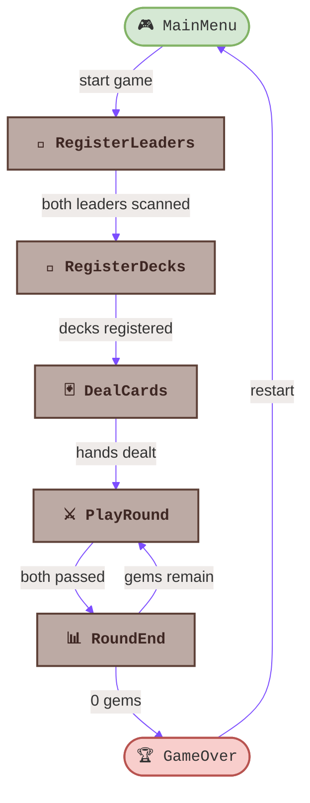
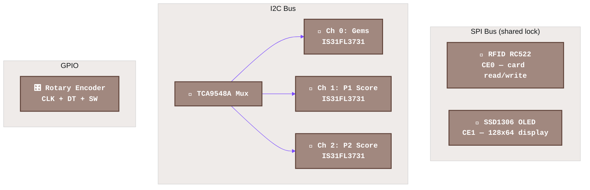
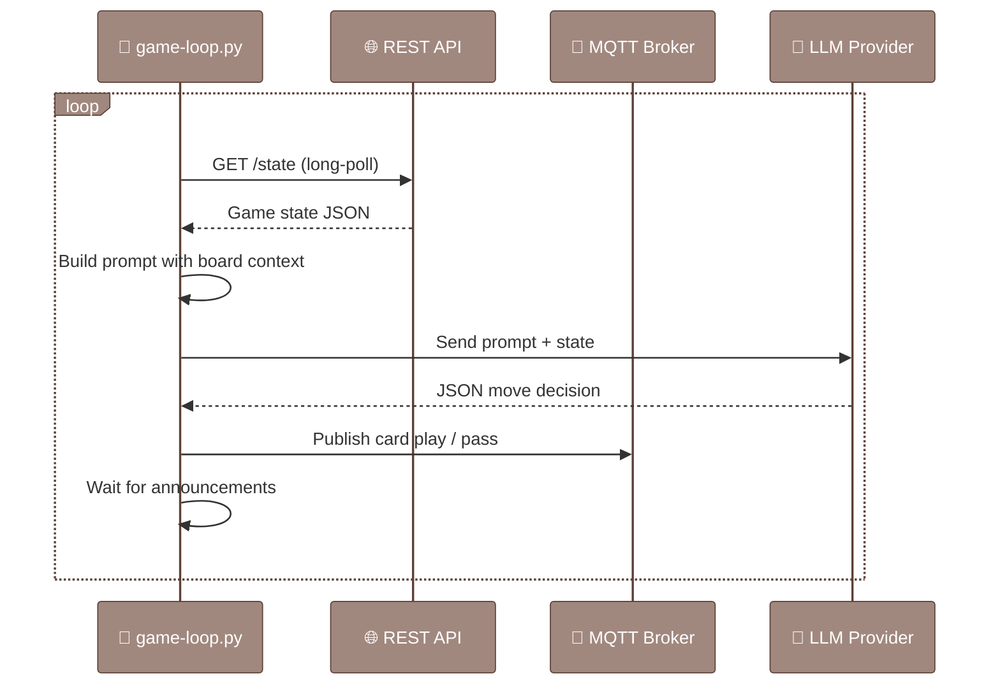
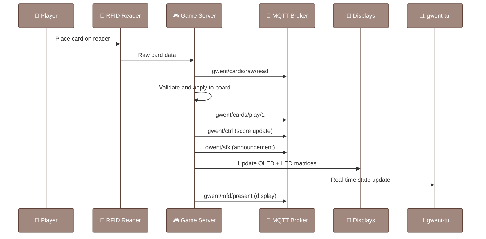

# Gwent Companion Architecture

This document is the comprehensive reference for the Gwent Companion system architecture. For specific subsystem details, see the linked documents throughout.

## System Overview

The Gwent Companion is a multi-process system centered on an MQTT message broker. The game server owns all game state and hardware; observers and drivers connect via MQTT and HTTP.



## Server Internals

The game server (`software/gwent/`) is a single Python process running as the `gwent` systemd service. Entry point: `gwent.game.main:run`.

### Startup Sequence

1. Configure logging
2. Initialize MQTT client (connect to Mosquitto broker)
3. Initialize hardware via HAL (SPI lock, I2C mux, OLED, matrices, RFID, rotary encoder)
4. Initialize Controller with all game stages
5. Start HTTP API server on port 8080
6. Enter main loop (MQTT message dispatch)

### Game Stages State Machine

The `Controller` class manages a state machine of `GameStage` subclasses. Each stage subscribes to relevant MQTT topics, processes events, and calls its `complete` callback to advance to the next stage.



Stage implementations live in `software/gwent/gwent/game/stages/`. For detailed flow diagrams within each stage, see [GwentGameStages.md](GwentGameStages.md).

### Pub/Sub System

All inter-component communication uses MQTT via the Mosquitto broker. The `PubSubComponent` base class (in `gwent.game.__init__`) wraps `paho-mqtt` and provides `publish()` / `subscribe()` methods with automatic message serialization through a factory pattern.

Message types are defined in `gwent.messaging.*`:

| Module | KIND | Purpose |
|--------|------|---------|
| `card` | `card` | Raw card scan data from RFID |
| `card_play` | `card_play` | Card played onto the board |
| `ctrl` | `ctrl` | Stage transitions and game control |
| `choice` | `choice` | Rotary encoder selections |
| `mfd` | `mfd` | OLED display content (present/choose) |
| `sfx` | `sfx` | Sound effect and TTS triggers |

For the full pub/sub diagram, see [GwentPubSub.md](GwentPubSub.md).

### MQTT Topic Structure

All topics are rooted under `gwent/`:

```
gwent/
  ctrl                    # Stage transitions, game control events
  cards/
    raw/
      read                # Raw RFID card scan data
      write               # RFID write commands
    play/
      1                   # Card played by player 1
      2                   # Card played by player 2
  mfd/
    present               # Display content pushed to OLED
    choose                # User selection via rotary encoder
  sfx                     # Sound effect and TTS triggers
  sfx/complete            # Announcement completion acknowledgments
```

The broker uses authenticated access (user: `geralt`, password: `gwent`).

### REST API

The HTTP API runs on port 8080 using stdlib `http.server` (no framework dependencies). Endpoints:

| Method | Path | Description |
|--------|------|-------------|
| `GET` | `/state` | Full game state snapshot. Supports long-polling via `If-None-Match` ETag and `?timeout=N` query param |
| `GET` | `/health` | Health check |
| `POST` | `/save?name=filename` | Save current state to recordings |
| `PUT` | `/players` | Set player names |
| `PUT` | `/client-tts` | Configure client-side TTS |

Implementation: `software/gwent/gwent/game/http_api.py`

### Hardware Abstraction Layer

The HAL isolates hardware-specific code behind clean interfaces. A shared SPI bus lock (`threading.RLock`) ensures the RFID reader (CE0) and OLED display (CE1) never collide.



Key HAL modules:

| Module | File | Devices |
|--------|------|---------|
| RFID | `hal/rfid.py`, `hal/mfrc522_entrypoints.py` | MFRC522 reader/writer |
| OLED | `hal/oled_ssd1306.py` | SSD1306 128x64 display |
| LED Matrices | `hal/matrix.py` | IS31FL3731 via TCA9548A I2C mux |
| MFD | `hal/mfd.py`, `hal/mfdi.py` | Multi-function display controller |
| Rotary | `hal/rotary_pigpio.py` | Rotary encoder via pigpio |
| Audio | `hal/audio.py` | pygame-based sound playback |

## TUI Architecture

The terminal dashboard (`software/gwent-tui/`) is built with [Textual](https://textual.textualize.io/) (Rich-based TUI framework). It provides a real-time view of the game state without touching any hardware.

```mermaid
%%{init: {
  'theme': 'base',
  'themeVariables': {
    'primaryColor': '#6d1a36',
    'primaryTextColor': '#333',
    'primaryBorderColor': '#7C4DFF',
    'lineColor': '#7C4DFF',
    'secondaryColor': '#D7CCC8',
    'tertiaryColor': '#EFEBE9',
    'fontFamily': 'Courier New',
    'fontSize': '16px'
  }
}}%%

flowchart LR
    subgraph sources["📡 Data Sources"]
        mqtt["MQTT Broker\ngwent/* topics"]
        rest["REST API\nGET /state"]
    end

    subgraph tui_app["📊 gwent-tui"]
        subscriber["MqttSubscriber\npaho-mqtt"]
        poller["SnapshotPoller\nHTTP long-poll"]
        state["GameState\nthread-safe model"]
        app["GwentTUI App\nTextual"]

        subgraph widgets["Stage Widgets"]
            hdr["HeaderWidget"]
            board["BoardWidget"]
            hands["HandsWidget"]
            decks["DecksWidget"]
            footer["FooterWidget"]
            overlay["CardImageOverlay"]
        end
    end

    mqtt --> subscriber
    rest --> poller
    subscriber --> state
    poller --> state
    state --> app
    app --> widgets

    classDef software fill:#BCAAA4,stroke:#5D4037,stroke-width:2px,color:#3E2723,font-family:'Courier New',font-weight:bold
    classDef data fill:#D7CCC8,stroke:#5D4037,stroke-width:2px,color:#3E2723,font-family:'Courier New',font-style:italic

    class mqtt,rest,subscriber,poller,state,app software
    class hdr,board,hands,decks,footer,overlay data
```



### Data Flow

1. **MqttSubscriber** connects to the broker and subscribes to `gwent/ctrl`, `gwent/mfd/*`, `gwent/sfx`, `gwent/cards/*` topics
2. **SnapshotPoller** long-polls `GET /state` with ETag for full state snapshots
3. Both feed into the thread-safe **GameState** model
4. The **GwentTUI** Textual app swaps stage-specific widget sets (matching the server's stage machine) and updates the display on each state change

Stage widgets in `gwent_tui/stages/`: `MainMenu`, `RegisterLeaders`, `RegisterDecks`, `DealCards`, `PlayRound`, `RoundEnd`, `GameOver`, `Offline`, `Unknown`.

The TUI also handles client-side TTS (announcing game events through local speakers) and publishes `sfx/complete` back to the broker when announcements finish.

## Game-Loop Orchestration

The LLM-vs-LLM orchestrator (`.claude/skills/llm-vs/scripts/game-loop.py`) automates full games between two AI models.



### Supported Providers

| Provider | Prefix | Example Aliases |
|----------|--------|-----------------|
| Anthropic | `anthropic/` | `sonnet`, `haiku`, `opus` |
| OpenAI | `openai/` | `gpt-4o`, `o3-mini` |
| Google Gemini | `gemini/` | `flash`, `pro` |
| Ollama (local) | `ollama/` | `deepseek`, `llama3` |

The orchestrator reads game state from the REST API, constructs a system prompt with full Gwent rules and board context, sends it to the selected LLM, parses the JSON response, and publishes the move via MQTT (`mosquitto_pub`). An `AnnouncementSync` listener waits for TTS completion before proceeding to the next turn.

## Data Model

### Cards

Card definitions are JSON files organized by faction in `software/data/cards/{Faction}/`:

```
software/data/cards/
  Monsters/           # Arachas, Fiend, Crones, etc.
  Nilfgaardian/       # Emhyr, Fringilla, spies, etc.
  NorthernRealms/     # Foltest, Blue Stripes, etc.
  Scoiatael/          # Francesca, Dwarves, etc.
  Skellige/           # Cerys, Berserkers, etc.
  Neutral/            # Geralt, Yennefer, weather cards
```

Each card JSON contains: `name`, `faction`, `strength`, `ranges` (combat rows), `abilities`, `starter` flag, `rfid` tag ID, optional `image` path and `card_text`.

For full card mechanics, see [GwentRules.md](GwentRules.md) and [GwentCardMechanics.md](GwentCardMechanics.md).

### Decks

Saved player decks in `software/data/decks/`. Each deck file references cards by name and faction.

### Recordings

Game state snapshots in `software/data/recordings/`. These capture the complete board state (hands, board rows, discard piles, scores, gems, round number) and can be loaded to resume a game at any point. Used for testing, replay, and the `playback-trace` workflow.

## Message Flow Example

A typical card play flows through the system like this:



## Related Documents

- [GwentRules.md](GwentRules.md) -- canonical game rules
- [GwentGameStages.md](GwentGameStages.md) -- detailed stage flow diagrams
- [GwentPubSub.md](GwentPubSub.md) -- full pub/sub architecture diagram
- [GwentCardMechanics.md](GwentCardMechanics.md) -- card specialties and abilities
- [GwentLeaders.md](GwentLeaders.md) -- leader abilities
- [GwentFactions.md](GwentFactions.md) -- faction passive abilities
- [000-product-requirements.md](000-product-requirements.md) -- original PRD
- [MermaidStyleGuide.md](MermaidStyleGuide.md) -- diagram styling conventions
