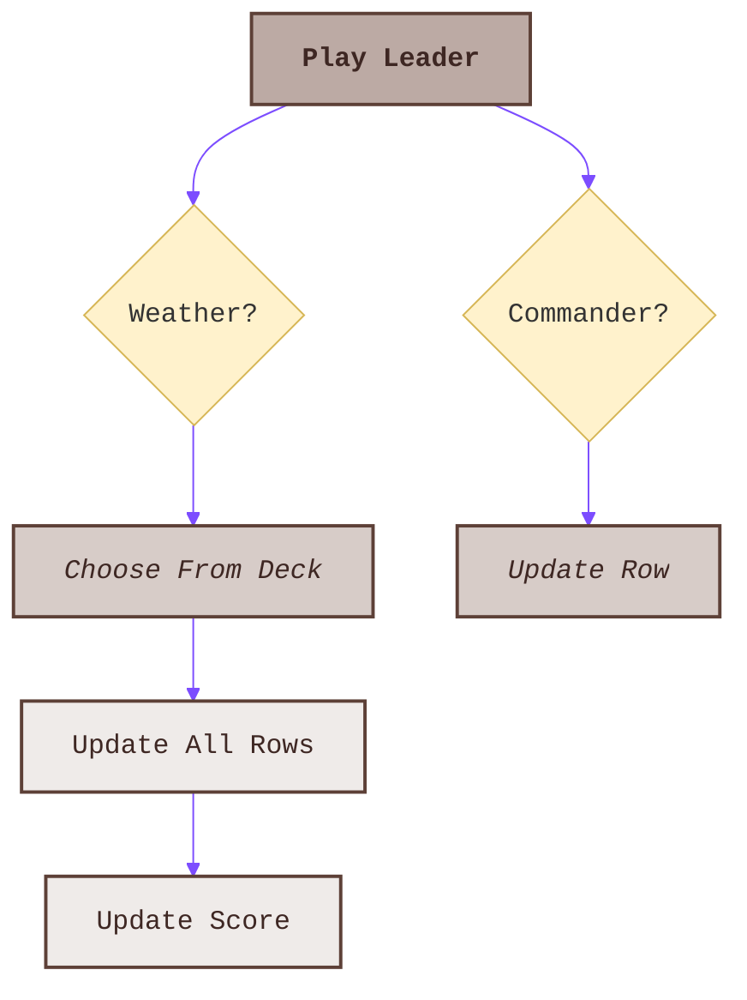
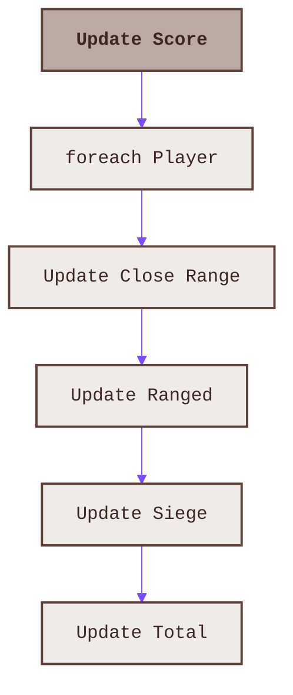

# 🎮 Gwent Companion Game Stages 🧙‍♂️

This document describes the complete game flow for the Gwent Companion, from the main menu through game completion.

## 🔄 Main Game Flow

```mermaid
%%{init: {
  'theme': 'base',
  'themeVariables': {
    'primaryColor': '#6d1a36',
    'primaryTextColor': '#333',
    'primaryBorderColor': '#7C4DFF',
    'lineColor': '#7C4DFF',
    'secondaryColor': '#D7CCC8',
    'tertiaryColor': '#EFEBE9',
    'fontFamily': 'Courier New',
    'fontSize': '16px',
    'edgeLabelBackground': '#EFEBE9'
  }
}}%%

flowchart TD
    MainMenu([Main Menu\n- start game]) --> StartGame[Start Game]
    StartGame --> RegisterPlayers[Register Players]
    RegisterPlayers --> RegisterDecks[Register Decks]

    %% Register Players subprocess
    RegisterPlayers --> RegPlr1[Register Player 1]
    RegisterPlayers --> RegPlr2[Register Player 2]
    RegPlr1 --> RegLdr1[Register Leader 1]
    RegPlr2 --> RegLdr2[Register Leader 2]

    %% Register Decks subprocess
    RegisterDecks --> ScanCardDeck[Scan Card]
    ScanCardDeck --> WhichPlayerDeck{Which Player}
    WhichPlayerDeck -->|plr1| AddPlr1Deck[Add to Plr1 Deck]
    WhichPlayerDeck -->|plr2| AddPlr2Deck[Add to Plr2 Deck]
    AddPlr1Deck --> FinishedDeck{Finished?}
    AddPlr2Deck --> FinishedDeck
    FinishedDeck -->|no| ScanCardDeck
    FinishedDeck -->|yes| DealCards

    %% Deal Cards
    DealCards[Deal Cards] --> ScanCardDeal[Scan Card]
    ScanCardDeal --> WhichPlayerDeal{Which Player}
    WhichPlayerDeal -->|plr1| AddPlr1Hand[Add to Plr1 Hand]
    WhichPlayerDeal -->|plr2| AddPlr2Hand[Add to Plr2 Hand]
    AddPlr1Hand --> FinishedDeal{Finished?}
    AddPlr2Hand --> FinishedDeal
    FinishedDeal -->|no| ScanCardDeal
    FinishedDeal -->|yes| PlayRound

    %% Play Round
    PlayRound[Play Round] --> ScoaitelCheck{Scoai'tel\nFaction?}
    ScoaitelCheck --> TossCoin[Toss Coin]
    PlayRound --> PlayCard[Play Card]

    %% Play Card abilities
    PlayCard --> HealerCheck{Healer?}
    PlayCard --> LeaderCheck{Leader?}
    PlayCard --> MusterCheck{Muster?}
    PlayCard --> SpyCheck{Spy?}

    HealerCheck --> ChooseDiscard[Choose 1 Discard]
    LeaderCheck --> PlayLeader[Play Leader]
    MusterCheck --> ChooseSameHand[Choose same\nFrom Hand]
    MusterCheck --> ChooseSameDeck[Choose same\nFrom Deck]
    SpyCheck --> Deal2FromDeck[Deal 2\nFrom Deck]

    ChooseDiscard --> UpdateScoreCard[Update Score]
    PlayLeader --> UpdateScoreCard
    ChooseSameHand --> UpdateScoreCard
    ChooseSameDeck --> UpdateScoreCard
    Deal2FromDeck --> UpdateScoreCard

    %% Pass or continue
    PlayCard --> Pass[Pass]
    Pass --> RoundEndCheck{Round End?}
    RoundEndCheck -->|no| PlayCard
    RoundEndCheck -->|yes| RoundEnd

    %% Round End
    RoundEnd[Round End] --> NilfgaardCheck{Nilfgaardian\nFaction?}
    NilfgaardCheck --> DetermineWinner[Determine Winner]
    DetermineWinner --> RemoveGem[Remove Gem]
    RemoveGem --> FactionAbility{Faction Ability?\n- monsters\n- northern realms\n- skellige}
    FactionAbility --> UpdateScoreRound[Update Score]
    UpdateScoreRound --> GameOverCheck{Game Over?}
    GameOverCheck -->|no| PlayRound
    GameOverCheck -->|yes| DisplayWinner[Display Winner]

    %% Class definitions
    classDef hardware fill:#A1887F,stroke:#5D4037,stroke-width:2px,color:#fff,font-family:'Courier New',font-weight:bold
    classDef software fill:#BCAAA4,stroke:#5D4037,stroke-width:2px,color:#3E2723,font-family:'Courier New',font-weight:bold
    classDef data fill:#D7CCC8,stroke:#5D4037,stroke-width:2px,color:#3E2723,font-family:'Courier New',font-style:italic
    classDef process fill:#EFEBE9,stroke:#5D4037,stroke-width:2px,color:#3E2723,font-family:'Courier New'
    classDef ui fill:#F5F5F5,stroke:#5D4037,stroke-width:2px,color:#3E2723,font-family:'Courier New'
    classDef start fill:#d5e8d4,stroke:#82b366,stroke-width:2px,color:#333,font-family:'Courier New'
    classDef endNode fill:#f8cecc,stroke:#b85450,stroke-width:2px,color:#333,font-family:'Courier New'
    classDef decision fill:#fff2cc,stroke:#d6b656,stroke-width:1px,color:#333,font-family:'Courier New'

    %% Apply classes
    class MainMenu start
    class DisplayWinner endNode
    class StartGame,RegisterPlayers,RegisterDecks,DealCards,PlayRound,RoundEnd software
    class RegPlr1,RegPlr2,RegLdr1,RegLdr2 process
    class ScanCardDeck,ScanCardDeal,TossCoin,PlayCard,Pass hardware
    class AddPlr1Deck,AddPlr2Deck,AddPlr1Hand,AddPlr2Hand,ChooseDiscard,ChooseSameHand,ChooseSameDeck,Deal2FromDeck data
    class PlayLeader,DetermineWinner,RemoveGem,UpdateScoreCard,UpdateScoreRound ui
    class WhichPlayerDeck,WhichPlayerDeal,FinishedDeck,FinishedDeal,ScoaitelCheck,HealerCheck,LeaderCheck,MusterCheck,SpyCheck,RoundEndCheck,NilfgaardCheck,FactionAbility,GameOverCheck decision
```

## ⚔️ Play Leader Subprocess

## 📊 Update Score Subprocess

