# 📊 Gwent Publish-Subscribe Architecture: The l33tC0dzr Edition ☕

This artisanal diagram represents the publish-subscribe architecture used for communication between components in the Gwent Companion system, crafted with care by our ivory tower architects.

```mermaid
%%{init: {
  'theme': 'base',
  'themeVariables': {
    'primaryColor': '#6d1a36',
    'primaryTextColor': '#fff',
    'primaryBorderColor': '#7C4DFF',
    'lineColor': '#7C4DFF',
    'secondaryColor': '#D7CCC8',
    'tertiaryColor': '#EFEBE9',
    'fontFamily': 'Courier New',
    'fontSize': '16px'
  }
}}%%

flowchart LR
    %% Hardware Components with Hipster Icons
    subgraph Hardware["🔧 Artisanal Hardware Components"]
        rfidReader["📡 RFID Reader\n(MFRC522)"]
        rfidWriter["✍️ RFID Writer\nFair-Trade Data Inscriber"]
        display["📱 Display\nOLED Canvas"]
        rotaryBtn["🎛️ Rotary Button\nVintage Interface"]
    end

    %% Software Components
    subgraph Software["💻 Craft Software"]
        mfd["🖥️ MFD\nMulti-Function Display"]
        pubsub["☕ Pub/Sub System\nFair-Trade Message Broker"]
        gameControl["🎮 Game Control\nOrganic Game Logic"]
        sfx["🎵 SFX\n(pygame)"]
        menus["📋 Menus\nHand-Crafted UI"]
    end

    %% Message Topics
    subgraph Topics["📨 Message Topics"]
        mfdTopic["mfd"]
        choosepresentTopic["choosepresent"]
        cardsTopic["cards"]
        rawTopic["raw"]
        readwriteTopic["readwrite"]
        playTopic["play"]
        sfxctrlTopic["sfxctrl"]
    end

    %% Game States as Vinyl Records
    subgraph GameStates["💿 Vinyl Collection Game States"]
        registerLeaders["🎵 Register Leaders"]
        registerDecks["🎵 Register Decks"]
        dealCards["🎵 Deal Cards"]
        playRound["🎵 Play Round"]
        playLeader["🎵 Play Leader"]
        roundEnd["🎵 Round End"]
        gameEnd["🎵 Game End"]
    end

    %% Display Components as Typewriter Keys
    subgraph DisplayComponents["⌨️ Vintage Display Components"]
        boardHand["🃏 Board/Hand\nLetterpress-Printed"]
        grave["⚰️ Grave\nReclaimed Soil"]
        deck["🎴 Deck\nSustainably Harvested"]
        player["👤 Player\nFree-Range"]
        close["⚔️ Close\nArtisanal Combat"]
        range["🏹 Range\nHand-Forged"]
        siegeTot["🏰 Siege Total\nSmall-Batch"]
    end

    %% Connections with Artisanal Flow
    rfidReader ==> rawTopic
    rawTopic ==> mfd
    mfd ==> mfdTopic
    mfdTopic ==> pubsub
    
    rotaryBtn ==> choosepresentTopic
    choosepresentTopic ==> pubsub
    
    pubsub ==> cardsTopic
    cardsTopic ==> gameControl
    
    gameControl ==> playTopic
    playTopic ==> pubsub
    
    pubsub ==> sfxctrlTopic
    sfxctrlTopic ==> sfx
    
    gameControl ==> menus
    menus ==> display
    
    pubsub ==> readwriteTopic
    readwriteTopic ==> rfidWriter
    
    gameControl ==> GameStates
    
    display ==> DisplayComponents
    
    %% Hipster Styling
    classDef hardware fill:#A1887F,stroke:#5D4037,stroke-width:2px,color:#fff,font-family:'Courier New',font-weight:bold
    classDef software fill:#BCAAA4,stroke:#5D4037,stroke-width:2px,color:#3E2723,font-family:'Courier New',font-weight:bold
    classDef topic fill:#D7CCC8,stroke:#5D4037,stroke-width:2px,color:#3E2723,font-family:'Courier New',font-style:italic
    classDef gameState fill:#EFEBE9,stroke:#5D4037,stroke-width:2px,color:#3E2723,font-family:'Courier New'
    classDef display fill:#F5F5F5,stroke:#5D4037,stroke-width:2px,color:#3E2723,font-family:'Courier New'
    
    class rfidReader,rfidWriter,display,rotaryBtn hardware
    class mfd,pubsub,gameControl,sfx,menus software
    class mfdTopic,choosepresentTopic,cardsTopic,rawTopic,readwriteTopic,playTopic,sfxctrlTopic topic
    class registerLeaders,registerDecks,dealCards,playRound,playLeader,roundEnd,gameEnd gameState
    class boardHand,grave,deck,player,close,range,siegeTot display
```

## 📜 Artisanal Component Descriptions

### 🔧 Handcrafted Hardware Components
- **📡 RFID Reader (MFRC522)**: Locally-sourced RFID tag reader for cards, with sustainable power consumption
- **✍️ RFID Writer**: Data reader/writer for RFID tags, crafted with care
- **📱 Display**: Small-batch OLED canvas for displaying game information and menus
- **🎛️ Rotary Button**: Vintage-inspired analog interface for navigation and selection, with authentic tactile feedback

### 💻 Craft Software Components
- **🖥️ MFD**: Multi-Function Display controller, coded in a Brooklyn warehouse
- **☕ Pub/Sub System**: Fair-trade message broker for component communication, with zero waste architecture
- **🎮 Game Control**: Organic game logic controller with gluten-free algorithms
- **🎵 SFX (pygame)**: Sound effects and audio system, mixed on vinyl
- **📋 Menus**: Hand-crafted menu system with locally-sourced UI elements

### 📨 Message Topics
- **mfd**: Display control messages
- **choosepresent**: User input selection messages
- **cards**: Card data messages
- **raw**: Raw RFID data
- **readwrite**: RFID write commands
- **play**: Game play actions
- **sfxctrl**: Sound effect control messages

### 💿 Vinyl Collection Game States
- **🎵 Register Leaders**: Leader card registration phase, pressed on 180g vinyl
- **🎵 Register Decks**: Deck registration phase, limited edition pressing
- **🎵 Deal Cards**: Card dealing phase, with analog warmth
- **🎵 Play Round**: Round gameplay phase, remastered from original tapes
- **🎵 Play Leader**: Leader card play phase, collector's edition
- **🎵 Round End**: End of round processing, with bonus tracks
- **🎵 Game End**: End of game processing, includes digital download code

### ⌨️ Vintage Display Components
- **🃏 Board/Hand**: Letterpress-printed card display areas
- **⚰️ Grave**: Reclaimed soil graveyard display
- **🎴 Deck**: Sustainably harvested deck display
- **👤 Player**: Free-range player information display
- **⚔️ Close**: Artisanal close combat row display
- **🏹 Range**: Hand-forged ranged combat row display
- **🏰 Siege Tot**: Small-batch siege total display, aged in oak barrels