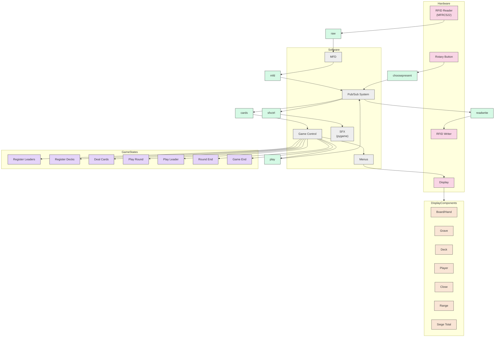

# Gwent Publish-Subscribe Architecture

This diagram represents the publish-subscribe architecture used for communication between components in the Gwent Companion system.

## Component Descriptions

### Hardware Components
- **RFID Reader (MFRC522)**: Reads RFID tags from cards
- **RFID Writer**: Writes data to RFID tags
- **Display**: Shows game information and menus
- **Rotary Button**: User input device for navigation and selection

### Software Components
- **MFD**: Multi-Function Display controller
- **Pub/Sub System**: Central message broker for component communication
- **Game Control**: Main game logic controller
- **SFX (pygame)**: Sound effects and audio system
- **Menus**: Menu system for user interaction

### Message Topics
- **mfd**: Display control messages
- **choosepresent**: User input selection messages
- **cards**: Card data messages
- **raw**: Raw RFID data
- **readwrite**: RFID write commands
- **play**: Game play actions
- **sfxctrl**: Sound effect control messages

### Game States
- **Register Leaders**: Leader card registration phase
- **Register Decks**: Deck registration phase
- **Deal Cards**: Card dealing phase
- **Play Round**: Round gameplay phase
- **Play Leader**: Leader card play phase
- **Round End**: End of round processing
- **Game End**: End of game processing

### Display Components
- **Board/Hand**: Card display areas
- **Grave**: Graveyard display
- **Deck**: Deck display
- **Player**: Player information display
- **Close**: Close combat row display
- **Range**: Ranged combat row display
- **Siege Tot**: Siege total display