# 🧵 Gwent Thread Model: The l33tC0dzr Edition ☕

This artisanal diagram represents the thread hierarchy and MQTT communication patterns in the Gwent Companion system, crafted with care by our ivory tower architects.

```mermaid
%%{init: {
  'theme': 'base',
  'themeVariables': {
    'primaryColor': '#6d1a36',
    'primaryTextColor': '#fff',
    'primaryBorderColor': '#7C4DFF',
    'lineColor': '#7C4DFF',
    'secondaryColor': '#D7CCC8',
    'tertiaryColor': '#EFEBE9',
    'fontFamily': 'Courier New',
    'fontSize': '16px'
  }
}}%%

flowchart TD
    %% Main Application Thread
    subgraph MainThread["🧠 Main Application Thread"]
        gwent["🎮 Gwent\nMain Application"]
    end

    %% MQTT Client Thread
    subgraph MQTTThread["☕ MQTT Client Thread"]
        mqttClient["📨 MQTT Client\nPaho MQTT"]
    end

    %% Component Threads
    subgraph ComponentThreads["🧵 Artisanal Component Threads"]
        controller["🎮 Controller\nGame Logic Thread"]
        roundKeeper["⏱️ RoundKeeper\nRound Management Thread"]
        playerOne["👤 Player One\nPlayer Management Thread"]
        playerTwo["👤 Player Two\nPlayer Management Thread"]
        reader["📡 Reader\nCard Reader Thread"]
        sfx["🎵 SFX\nSound Effects Thread"]
        statePub["📤 StatePublisher\nRetained Snapshot Thread"]
        menuPub["📋 MenuPublisher\nMenu Mirror Thread"]
        srvCmd["⚙️ ServerCommandHandler\ngwent/ctrl/* Thread"]
        llmMgr["🤖 LLMPlayerManager\nAI Driver Thread"]
        camClient["📷 CameraClient\nRecording Bridge Thread"]
    end

    %% MQTT Topics
    subgraph Topics["📨 Handcrafted Message Topics"]
        mfdTopic["mfd\nDisplay Control Messages"]
        choosepresentTopic["choosepresent\nUser Input Selection"]
        cardsTopic["cards\nCard Data Messages"]
        rawTopic["raw\nRaw RFID Data"]
        readwriteTopic["readwrite\nRFID Write Commands"]
        playTopic["play\nGame Play Actions"]
        sfxctrlTopic["sfxctrl\nSound Effect Control"]
    end

    %% Thread Creation Relationships
    gwent ==> mqttClient
    gwent ==> controller
    gwent ==> roundKeeper
    gwent ==> playerOne
    gwent ==> playerTwo
    gwent ==> reader
    gwent ==> sfx
    gwent ==> statePub
    gwent ==> menuPub
    gwent ==> srvCmd
    gwent ==> llmMgr
    gwent ==> camClient

    %% MQTT Publish Relationships (solid lines)
    reader -- "Publishes" --> rawTopic
    controller -- "Publishes" --> mfdTopic
    controller -- "Publishes" --> playTopic
    controller -- "Publishes" --> readwriteTopic
    controller -- "Publishes" --> sfxctrlTopic
    controller -- "Publishes" --> cardsTopic
    playerOne -- "Publishes" --> playTopic
    playerTwo -- "Publishes" --> playTopic

    %% MQTT Subscribe Relationships (dashed lines)
    rawTopic -. "Subscribes" .-> controller
    mfdTopic -. "Subscribes (TUI)" .-> menuPub
    choosepresentTopic -. "Subscribes" .-> controller
    cardsTopic -. "Subscribes" .-> playerOne
    cardsTopic -. "Subscribes" .-> playerTwo
    cardsTopic -. "Subscribes" .-> roundKeeper
    playTopic -. "Subscribes" .-> roundKeeper
    playTopic -. "Subscribes" .-> controller
    sfxctrlTopic -. "Subscribes" .-> sfx
    readwriteTopic -. "Subscribes" .-> reader

    %% Styling
    classDef mainThread fill:#6d1a36,stroke:#5D4037,stroke-width:2px,color:#fff,font-family:'Courier New',font-weight:bold
    classDef mqttThread fill:#d4af37,stroke:#5D4037,stroke-width:2px,color:#3E2723,font-family:'Courier New',font-weight:bold
    classDef componentThread fill:#BCAAA4,stroke:#5D4037,stroke-width:2px,color:#3E2723,font-family:'Courier New',font-weight:bold
    classDef topic fill:#D7CCC8,stroke:#5D4037,stroke-width:2px,color:#3E2723,font-family:'Courier New',font-style:italic
    
    class gwent mainThread
    class mqttClient mqttThread
    class controller,roundKeeper,playerOne,playerTwo,reader,sfx,statePub,menuPub,srvCmd,llmMgr,camClient componentThread
    class mfdTopic,choosepresentTopic,cardsTopic,rawTopic,readwriteTopic,playTopic,sfxctrlTopic topic
```

## 📜 Artisanal Thread Descriptions

### 🧠 Main Application Thread
- **🎮 Gwent**: The main application thread that initializes the system, creates component threads, and manages the application lifecycle. Crafted with sustainable, locally-sourced code.

### ☕ MQTT Client Thread
- **📨 MQTT Client**: A fair-trade message broker thread that handles all MQTT communication, running asynchronously from the main thread. Roasted to perfection.

### 🧵 Artisanal Component Threads
- **🎮 Controller**: Game logic thread that orchestrates the game flow and state transitions. Brewed with organic, gluten-free algorithms.
- **⏱️ RoundKeeper**: Round management thread that tracks round state and scores. Small-batch processed for maximum flavor.
- **👤 Player One/Two**: Player management threads that handle player-specific game state. Free-range and ethically sourced.
- **📡 Reader**: Card reader thread that processes RFID card data. Harvested at peak ripeness.
- **🎵 SFX**: Sound effects thread that handles audio feedback. Mixed on vinyl for that authentic analog warmth.
- **📤 StatePublisher**: Mirrors the full game-state snapshot to the retained `gwent/server/state` topic. Single source of truth, cold-pressed.
- **📋 MenuPublisher**: Publishes the retained TUI menu mirror and the interactive-pick (`mfd/present`) popups. The touchscreen renders them — no OLED in this warehouse anymore.
- **⚙️ ServerCommandHandler**: Handles `gwent/ctrl/*` commands (player names/pronouns, client-TTS). The full command-and-control plane is MQTT; there is no HTTP.
- **🤖 LLMPlayerManager**: Drives AI-controlled sides when a player is assigned to an LLM. Locally-sourced inference.
- **📷 CameraClient**: Fail-soft bridge to the standalone `gwent-camera` service — toggles recording on game start/over. If the camera service is down, games proceed unrecorded.

> The legacy **🖥️ MFD** thread (OLED + rotary encoder) is no longer created — `GWENT_DISABLE_MFD=true` in `gwent.service` skips it, since that hardware was composted. The interactive-pick flow now lives in the touchscreen TUI.

### 📨 Handcrafted Message Topics
- **mfd**: Interactive-pick content (`mfd/present`) published by the server, rendered by the touchscreen TUI as a popup
- **choosepresent**: Pick replies (`mfd/choose`) from the TUI tap, subscribed by Controller (was the rotary)
- **cards**: Card data messages published by Controller, subscribed by Players and RoundKeeper
- **raw**: Raw RFID data published by Reader, subscribed by Controller
- **readwrite**: RFID write commands published by Controller, subscribed by Reader
- **play**: Game play actions published by Controller and Players, subscribed by RoundKeeper and Controller
- **sfxctrl**: Sound effect control messages published by Controller, subscribed by SFX

## 🔄 Thread Lifecycle

The thread lifecycle follows an artisanal, hand-crafted process:

1. The main Gwent thread initializes the application
2. It creates and starts the MQTT client thread
3. It then creates and initializes all component threads
4. Each component thread runs independently, communicating via MQTT topics
5. On shutdown, the main thread gracefully terminates all component threads
6. Finally, it closes the MQTT client thread

This thread model ensures a decoupled, event-driven architecture where components can be developed and tested independently, much like the careful separation of ingredients in a craft cocktail.