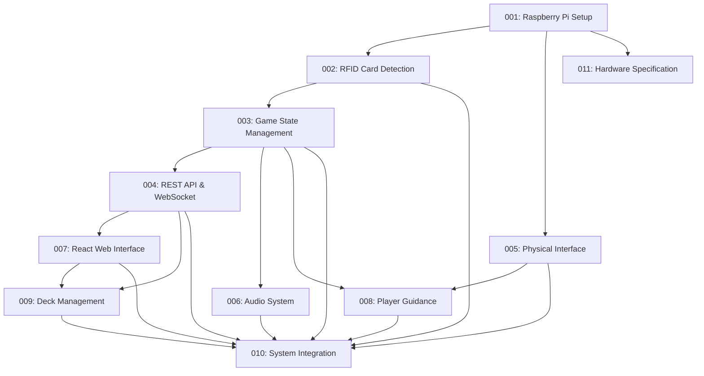

# Gwent Companion Implementation Tasks

This document provides an overview of all tasks required for implementing the Gwent Companion system, a physical-digital hybrid gaming system that enhances the traditional Gwent card game experience by combining physical RFID-enabled cards with a digital companion device.

## Task Overview

| ID | Title | Priority | Status | Dependencies |
|----|-------|----------|--------|-------------|
| 001 | [Setup Raspberry Pi Development Environment](001-raspberry-pi-setup.md) | 🔴 High | 🟠 Pending | None |
| 002 | [Implement RFID Card Detection System](002-rfid-card-detection.md) | 🔴 High | 🟠 Pending | 001 |
| 003 | [Develop Game State Management System](003-game-state-management.md) | 🔴 High | 🟠 Pending | 002 |
| 004 | [Build REST API and WebSocket Server](004-rest-api-websocket.md) | 🔴 High | 🟠 Pending | 003 |
| 005 | [Create Physical Interface Controls](005-physical-interface.md) | 🟠 Medium | 🟢 Completed | 001 |
| 006 | [Implement Audio System](006-audio-system.md) | 🟠 Medium | 🟢 Completed | 003 |
| 007 | [Develop React Web Interface (SPA)](007-react-web-interface.md) | 🔴 High | 🟠 Pending | 004 |
| 008 | [Implement Player Guidance System](008-player-guidance-system.md) | 🟠 Medium | 🟠 Pending | 003, 005 |
| 009 | [Develop Deck Management System](009-deck-management.md) | 🟢 Low | 🟠 Pending | 004, 007 |
| 010 | [Implement System Integration and Deployment](010-system-integration.md) | 🟠 Medium | 🟠 Pending | 002, 003, 004, 005, 006, 007, 008, 009 |
| 011 | [Hardware Component Specification](011-hardware-specification.md) | 🔴 High | 🟢 Completed | 001 |

## Task Dependencies Diagram

## Implementation Phases

### Phase 1: Foundation
- Task 001: Setup Raspberry Pi Development Environment
- Task 011: Hardware Component Specification

### Phase 2: Core Systems
- Task 002: Implement RFID Card Detection System
- Task 003: Develop Game State Management System
- Task 005: Create Physical Interface Controls

### Phase 3: Communication Layer
- Task 004: Build REST API and WebSocket Server
- Task 006: Implement Audio System

### Phase 4: User Interfaces
- Task 007: Develop React Web Interface (SPA)
- Task 008: Implement Player Guidance System
- Task 009: Develop Deck Management System

### Phase 5: Integration and Deployment
- Task 010: Implement System Integration and Deployment

## Priority Legend
- 🔴 High: Critical for core functionality
- 🟠 Medium: Important for user experience
- 🟢 Low: Enhances functionality but not critical

## Status Legend
- 🟢 Completed: Task has been completed
- 🟠 Pending: Task is waiting to be started
- 🔵 In Progress: Task is currently being worked on
- 🟡 Blocked: Task is blocked by dependencies