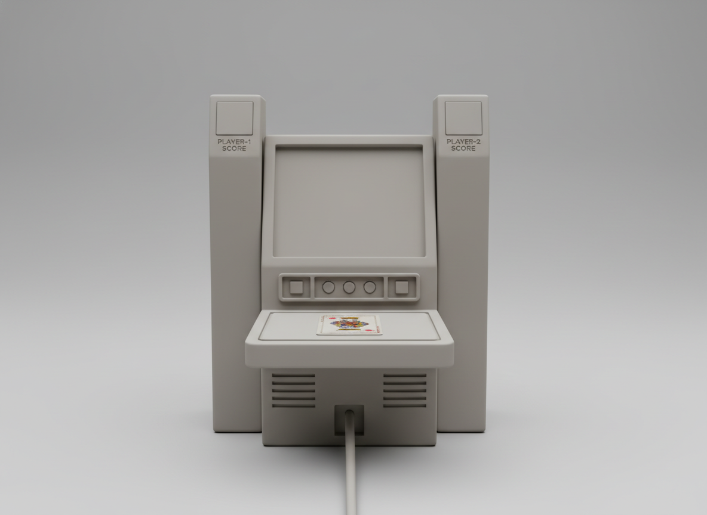
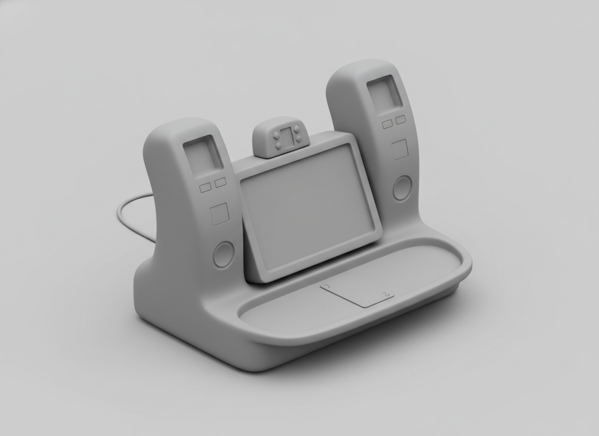
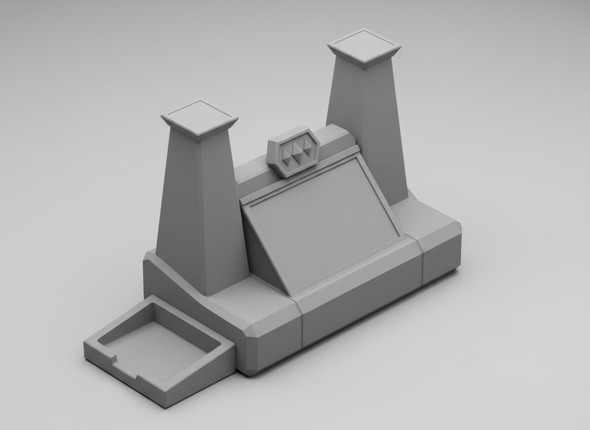
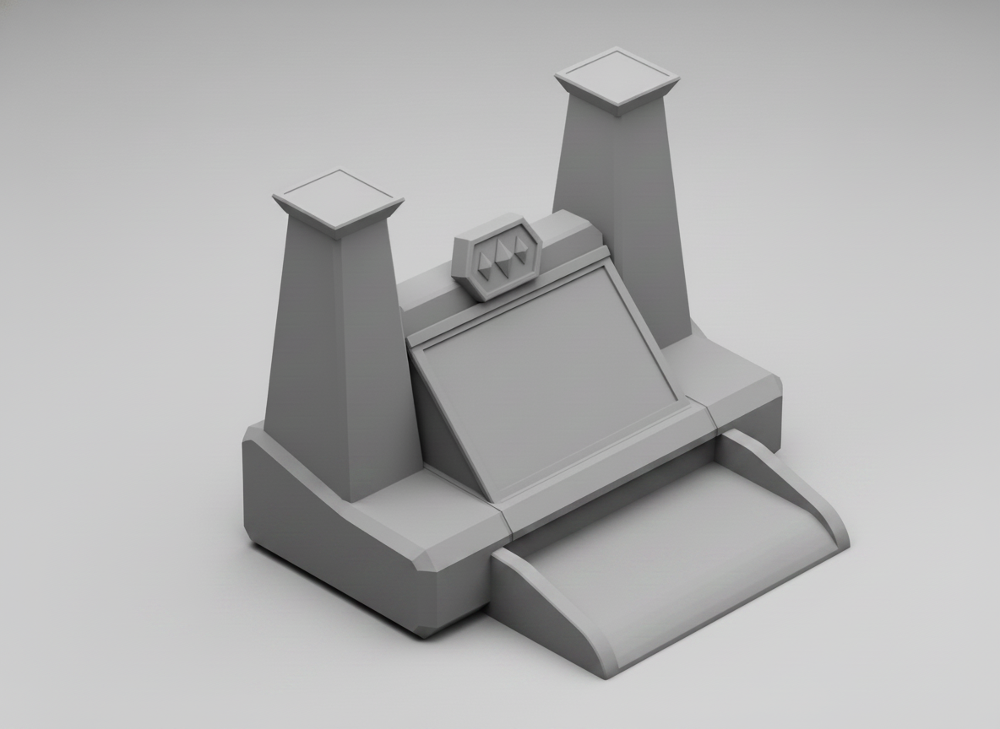
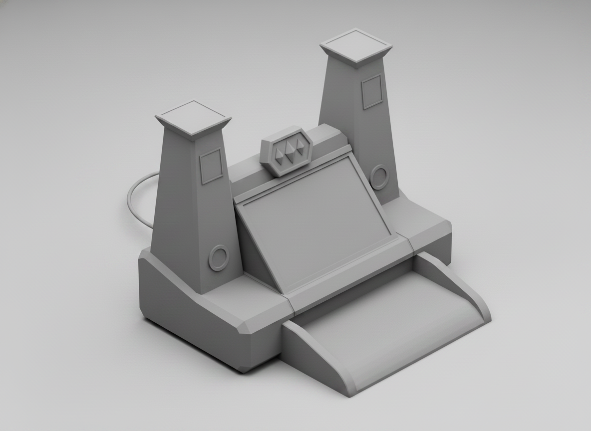
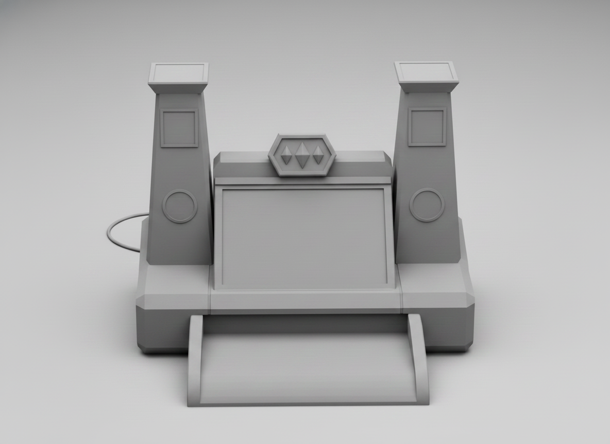
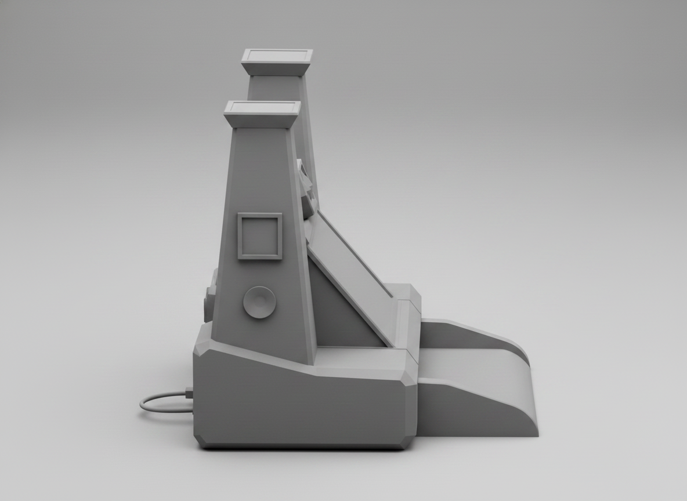

# Gwent Companion — Enclosure Concept Brief & Image-Gen Meta-Prompt

**Two phases:** **(A) Physical form study — do this first** (silhouette, proportion, layout,
neutral grey clay, no styling), then **(B) Stylization** (apply Witcher look to the chosen
form). Fill the `[KNOBS]`, assemble a prompt, run through the `imagen` meta-skill, drop
output in `concepts/`, log it. Iterate wide first, then converge.

---

## Design lineage — from baby to full-fledged (→ Kaer Morhen)

The form converged over five neutral clay-study passes. The **chosen** design at each phase
is embedded below; **“others”** links point to the variants that lost. Read top-to-bottom to
watch it grow from a rough silhouette into the locked **Kaer Morhen** reference.

### 1 · Pick a silhouette — *form study (8 candidates)*
Chose **#3 side-towers**: a central screen guarded by two flanking towers.



Others: [01 wedge](concepts/form-01-wedge-monolith.png) · [02 screen-block](concepts/form-02-screenblock-deck.png) · [04 drafting-table](concepts/form-04-drafting-table.png) · [05 ziggurat](concepts/form-05-ziggurat.png) · [06 easel](concepts/form-06-easel-lectern.png) · [07 obelisk](concepts/form-07-tower-obelisk.png) · [08 clamshell](concepts/form-08-clamshell.png)

⬇

### 2 · Integrate into one body — *iso-a…f*
Chose **iso-f**: the towers rise out of a single soft, unified body.



Others: [a](concepts/form-03-side-towers/form-03-iso-a.png) · [b](concepts/form-03-side-towers/form-03-iso-b.png) · [c](concepts/form-03-side-towers/form-03-iso-c.png) · [d](concepts/form-03-side-towers/form-03-iso-d.png) · [e](concepts/form-03-side-towers/form-03-iso-e.png)

⬇

### 3 · Riff the tower form — *var-a…f*
Chose **var-f**: faceted, angular “castle-keep” towers.



Others: [a](concepts/form-03-side-towers/form-03-iso-f/var-a.png) · [b](concepts/form-03-side-towers/form-03-iso-f/var-b.png) · [c](concepts/form-03-side-towers/form-03-iso-f/var-c.png) · [d](concepts/form-03-side-towers/form-03-iso-f/var-d.png) · [e](concepts/form-03-side-towers/form-03-iso-f/var-e.png)

⬇

### 4 · Fix the card shelf — *shelf-a…d, d2-a/b* · ✅ **FINAL DESIGN → Kaer Morhen**
Chose **shelf-d2-b** as the **final, locked design** (= `kaer-morhen/_ref.png`): the tall
faceted **castle-keep towers** (score panel + front speaker each), central ~65° screen, gems
crest above, and a front-center tray whose outer edge is **lip-free and ramps to the desk**
so cards slide on/off.



Others: [a](concepts/form-03-side-towers/form-03-iso-f/var-f/shelf-a.png) · [b](concepts/form-03-side-towers/form-03-iso-f/var-f/shelf-b.png) · [c](concepts/form-03-side-towers/form-03-iso-f/var-f/shelf-c.png) · [d](concepts/form-03-side-towers/form-03-iso-f/var-f/shelf-d.png) · [d2-a](concepts/form-03-side-towers/form-03-iso-f/var-f/shelf-d2-a.png)

⬇

### 5 · *(explored & reverted)* — low/wide towers with side speakers
A later pass tried dropping the towers **low & wide (~2:1)** with the score displays on top
and the speakers on the outer side faces (candidates hero-a…d). **This direction was
reverted** — the final design is the **tall faceted keeps of shelf-d2-b** above.

### 🏰 Locked reference views — `kaer-morhen/`
  

Full set (the official Fusion 360 reference): `iso-clean`, `ortho-front`, `ortho-side`,
`ortho-top`, `ortho-rear` + the spec in [`kaer-morhen/brief.md`](kaer-morhen/brief.md).

---

## What this device is

A tabletop, all-in-one **companion console for playing Gwent** (the card game from *The
Witcher 3*). It runs the game on a touchscreen, keeps score, and reads the players'
**physical RFID cards**.

**User-facing hardware (what shows on the outside):**
- A **7-inch touchscreen** (the main UI), tilted up toward the players.
- Three **LED matrix panels** forming a scoreboard: **player-1 score · life-gems · player-2 score**.
- An **RFID card reader** — a flat tap pad where a player rests/taps a physical card.

**Dropped to save space:** the small OLED status display and the rotary encoder/knob.

**Internal (must be housed, drives the body's bulk):** Raspberry Pi 4 + HAT, a
**112 × 76 × 35 mm power brick**, a small audio amplifier, a ground-loop isolator, and
**two speakers** (behind grilles).

---

## Phase A — Physical form study  (CURRENT — render NEUTRAL)

Goal: find the **shape**. Explore silhouettes, proportions, and where the elements sit.
Render as a **neutral grey clay / foam industrial-design model — no color, materials, or
ornament.** We choose a form here, then style it in Phase B. Run the skill with
`--no-base` so the Witcher style layer is skipped.

### Required physical elements (all must appear; arrangement is the variable)

1. A **~7-inch screen tilted ~65° upward**.
2. A horizontal **three-panel LED scoreboard** — three small square-ish glowing panels in
   a row: P1 score · life-gems · P2 score.
3. A flat **RFID card-tap pad** where a physical card rests.
4. **Speaker grille(s)** on the body.
5. A **power cord** exiting the back.
6. A **body with real internal bulk** — enough to house a single-board computer, a
   ~112 × 76 × 35 mm power brick, an amplifier, an isolator and two speakers.

*(No OLED, no knob.)*

### FORM knobs — *iterate these hardest*

- **SILHOUETTE / FORM:** `[ compact wedge monolith | upright screen block + separate front
  deck slab | central screen with flanking score towers | low wide drafting-table wedge |
  tiered/stepped ziggurat | angled easel/lectern on a deep base | vertical tower/obelisk |
  clamshell fold-open case ]`
- **SCOREBOARD PLACEMENT:** `[ across the front deck | a header strip above the screen |
  split onto two side towers | a row directly under the screen ]`
- **RFID PAD PLACEMENT:** `[ front shelf | top deck beside the scoreboard | a recessed well
  | a shallow pull-out tray ]`
- **PROPORTION / FOOTPRINT:** `[ tall & compact | low & wide | deep & chunky | slim ]`
- **SCREEN MOUNT:** `[ flush in the sloped face | raised on a short neck | recessed in a
  bezel well ]`

### RENDER knobs (keep neutral for the form study)

- **RENDER:** neutral matte grey clay / foam model, soft studio lighting, plain seamless
  background, subtle ambient occlusion — **no color, no materials, no ornament**.
- **VIEW:** `[ 3/4 hero | straight side profile showing the 65° tilt and depth | front
  elevation | top-down ]`

### Embedded image-content prompt (consumed by the `imagen` meta-skill)

The skill is *fed* the block between the markers as its embedded prompt. Run, e.g.:

```
npx tsx .claude/skills/imagen/generate.ts --no-base \
  --brief hardware/enclosure/design-outline.md \
  --size 4:3 --output hardware/enclosure/concepts/form-01.png \
  "FORM=compact wedge monolith; SCOREBOARD=across the front deck; RFID=front shelf; PROPORTION=low and wide; VIEW=3/4 hero"
```

<!-- imagen:brief:start -->
Industrial-design FORM STUDY of a tabletop all-in-one Gwent game console — rendered as a
neutral matte grey clay / foam model with soft studio lighting and a plain seamless
background. NO color, NO materials, NO branding, NO ornament: this is about pure physical
form, proportion and layout only. The object MUST include all of: a ~7-inch screen tilted
about 65 degrees upward; a horizontal three-panel LED scoreboard (three small square
panels in a row — player-1 score, life-gems, player-2 score); a flat RFID card-tap pad
where a physical playing card rests; speaker grilles; a power cord exiting the back; and a
body with enough internal bulk to house a single-board computer, a power brick, an
amplifier and two speakers. There is NO small secondary screen and NO knob. One cohesive
solid form, clean readable geometry. No text, no logos, no human hands.
<!-- imagen:brief:end -->

First batch: 6–8 variants spanning very different SILHOUETTE × PLACEMENT combos so the
form space is wide; then narrow to a favorite proportion/layout.

---

## Phase B — Stylization  (LATER, after a form is chosen)

Once a physical form wins, re-render it *with* the Witcher look (drop `--no-base`, or fold
these into the variant). Aesthetic knobs to vary then:

- **MATERIAL:** `[ aged bronze | blackened iron | carved dark oak | bone & ivory |
  weathered leather & brass | Nilfgaardian black steel | Skellige timber & rope |
  arcane carved stone ]`
- **MOTIF:** `[ Witcher wolf-school medallion | Northern Realms heraldry | elder runes |
  dark-fantasy filigree | battlefield-map etchings ]`
- **STYLE/ERA:** `[ medieval rustic | ornate baroque | grimdark war-worn | arcane-steampunk
  | clean stylized prop ]`
- **PALETTE · MOOD/LIGHTING · WEAR · SCREEN FRAMING** — as taste dictates.

### Avoid (all phases)

Branding/logos, visible screws/fasteners, readable UI text, photoreal hands, and — for
Phase A — any color, material or decoration.

---

## Iteration log

**LOCKED DIRECTION → `hardware/enclosure/kaer-morhen/`** (the **official physical reference**
for Fusion 360). Evolved from #3 side-towers: `concepts/form-03-side-towers/` → `iso-f`
(unified body) → `var-f` (faceted keep-towers) → **`shelf-d2-b`** (lip-free front ramp shelf)
= the **FINAL design** (`_ref.png`). A later low/wide-tower pass (hero-c) was **explored and
reverted**. See `kaer-morhen/brief.md` for the source-of-truth spec;
`kaer-morhen/{iso-clean,ortho-front,ortho-side,ortho-top,ortho-rear}.png` are the consistent
reference views.

**Kaer Morhen — locked geometry:** one continuous faceted single body (a keep with twin
towers); brick is the central base behind the central **7″ screen tilted ~65°**; **two TALL
faceted "castle-keep" player towers** flanking the screen, each carrying a **score display
(~50×25 mm + cover) on its upper FRONT face** and a **round speaker on its FRONT face** below
it; **gems panel** on a centerpiece crest above the screen; **front-center card shelf** with
a **lip-free ramp** down to the desk; power cord at the rear. Footprint **≤ 250 × 250 mm**
(fits the X1C 256 mm plate). OLED + rotary encoder dropped.

### Batch A1 — physical form study (2026-06-01, `gemini-2.5-flash-image`, `--no-base`)

| # | File | FORM | scoreboard | RFID | verdict |
|---|------|------|-----------|------|---------|
| A1-01 | `concepts/form-01-wedge-monolith.png` | compact wedge | under screen | front shelf | Most compact & buildable; everything on one slope + shelf. |
| A1-02 | `concepts/form-02-screenblock-deck.png` | screen block + front deck | under screen | big front deck | Roomiest body for internals; generous card deck. |
| A1-03 | `concepts/form-03-side-towers.png` | central screen + 2 score towers | side towers + gems under screen | front shelf | Literal P1/P2 towers; symmetric, taller. |
| A1-04 | `concepts/form-04-drafting-table.png` | low-wide reclined slab | across deck | top deck | Most open deck area for cards; low profile. |
| A1-05 | `concepts/form-05-ziggurat.png` | tiered stepped | header above screen | recessed well | Chunky, big internal volume; stepped read. |
| A1-06 | `concepts/form-06-easel-lectern.png` | easel on deep base | under screen | pull-out tray | Clever pull-out card tray; compact. |
| A1-07 | `concepts/form-07-tower-obelisk.png` | vertical totem/kiosk | header above screen | front shelf | Floor-kiosk vibe; tall, less tabletop. |
| A1-08 | `concepts/form-08-clamshell.png` | fold-open case | base deck | base well | Portable; deep base for electronics. |
